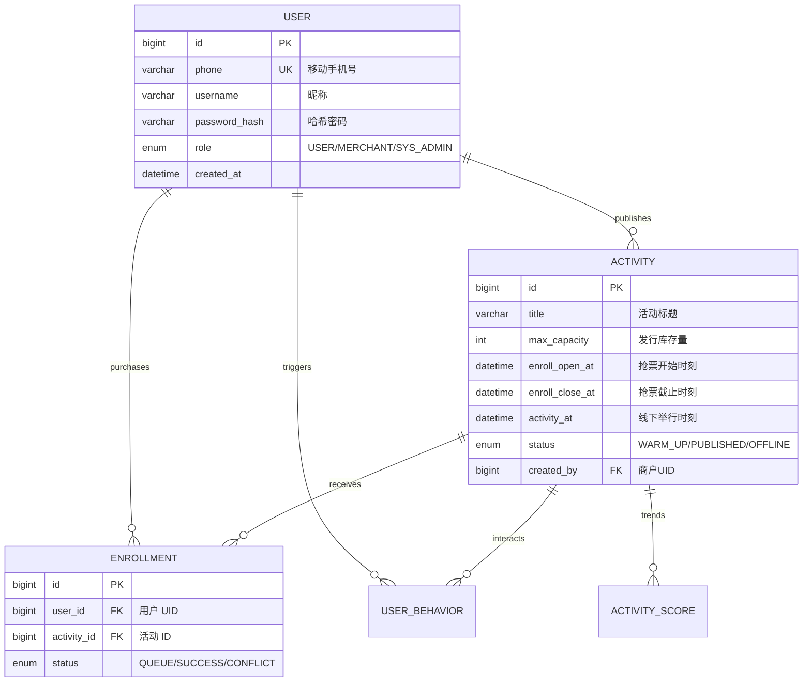

# 软件需求规格说明书
# 全域大型活动聚合分发平台（UAAD）
## Software Requirements Specification

| 文档属性 | 内容 |
|---|---|
| **项目名称** | 全域大型活动聚合分发平台（Universal Activity Aggregation & Distribution Platform，简称 UAAD） |
| **文档版本** | v2.0 |
| **撰写日期** | 2026-03-18 |
| **隶属课程** | 大规模信息系统开发试验（ULSS-26） |
| **文档状态** | 正式草稿（Formal Draft） |

---

## 目录

1. 引言
2. 总体描述
3. 系统功能性需求
4. 系统非功能性需求
5. 系统架构设计
6. 数据需求
7. 接口需求
8. 迭代与交付规划
9. 附录

---

## 1. 引言（Introduction）

### 1.1 目的
本文档是《全域大型活动聚合分发平台（UAAD）》项目的正式需求规格说明书（SRS），面向全体开发团队成员（前端组、后端组）、测试人员及架构指导。文档旨在完整、准确、无歧义地描述系统的功能边界、技术约束与验证标准，是后续跨大区部署、设计、实现与高并发测试的基准参考文件。

### 1.2 项目背景
当前社会领域内的大型会议、全国性演唱会、博览会及电竞赛事等活动信息散落于多个渠道，用户在信息获取与报名层面的体验极其碎片化。尤其是明星级演出及热门活动的抢票时刻，海量互联网真实用户同时涌入报名接口，瞬间并发压力极大，频繁引发传统系统崩溃、超卖、支付不一致等灾难级工程问题。

本系统以"**全网数据聚合、智能算法分发、分布式架构保障极限并发**"为核心设计理念，构建一个面向全网千万级用户的通用型大型活动发现与抢票一体化平台。

### 1.3 大规模系统对齐说明
本系统的建设完整覆盖分布式系统设计中所要求的"大规模"三大核心挑战：

| 课程定义的大规模维度 | 本系统的具体体现 |
|---|---|
| **大量的小数据** | 千万级用户的每次浏览、收藏、点击、支付回调及排队流水，均写入分布式行为表，随节点扩展持续爆发增长 |
| **大规模的各种算法** | 活动热度多维加权评分算法（离线与近实时计算结合）、基于用户行为图谱的千人千面协同过滤推荐算法 |
| **大量的交互** | 顶流级活动开票瞬间，预计支撑十万乃至百万级 TPS（每秒事务处理量），通过 Redis 集群原子操作、异步队列与柔性事务实现削峰填谷 |

### 1.4 术语与缩略语

| 术语 | 解释 |
|---|---|
| UAAD | Universal Activity Aggregation & Distribution Platform，本系统简称 |
| 活动 | 泛指演唱会、博览会、电竞赛事等需要进行线上防超卖抢票的社会级大型事件 |
| 报名 / 抢票 | 用户针对某一活动发出参与（资源锁定）请求的行为 |
| 名额 / 库存 | 某活动的最高接待/出票上限，是决不能超发的核心资产 |
| JWT | JSON Web Token，本系统采用的去中心化鉴权令牌 |
| MQ / Kafka | 用于抢票请求异步解耦和削峰填谷的高吞吐分布式消息系统 |

---

## 2. 总体描述（Overall Description）

### 2.1 产品愿景
一个"让千万网民享受丝滑抢票与精准推荐"的全域级系统。
- **对用户**：打破信息茧房发现兴趣活动；体验极端流量下绝对公平、不崩溃的参与通道。
- **对主办方**：提供百万流量池分发能力；秒级售罄的自动化清算架构；观众画像一目了然。

### 2.2 用户类型（User Classes）

| 用户类型 | 描述 | 主要操作权限 |
|---|---|---|
| **普通用户(C 端)** | 通过手机号实名注册的基础消费者 | 注册/登录、浏览推荐、高频收藏、发压抢票、查询订单 |
| **主办平台方(B 端)** | 入驻平台的活动主办方或总运营人员 | 以上全部权限 + 发起万人级活动、上架/改价、查看商业报表 |

### 2.3 运行环境
- **前端客户端**：由 Vite + React 构建的高性能响应式 Web 应用。支持 PC 端及移动端内嵌 H5。
- **后端服务端**：基于 Go 语言构建的微服务群，运行于 K8s (Kubernetes) 编排的云原生容器集群。
- **中间件依赖**：Redis (扣减与限流)、Kafka (异步削峰)、MySQL (核心持久化)。
- **部署理念**：利用 CDN 就近分发静态资产，API 接入层通过多级 Load Balancer 进行流量全域分发。

### 2.4 约束条件
1. 核心抢票链路严禁使用单库事务阻塞模式，强制使用缓存扣减 + MQ 最终一致性方案。
2. 不得将第三方组件（如 Redis）作为强一致性数据的唯一落盘节点，必须有 DB 兜底保障。

### 2.5 软件形态（Software Form）
UAAD 并非简单的单体系统，其软件形态定义为“**全链路负载解耦、数据最终一致性的云原生分布式聚合分发平台**”：
- **无状态化设计**：核心业务逻辑节点无状态，支持在 K8s 中基于 HPA (Horizontal Pod Autoscaler) 进行分钟级扩缩容。
- **读写异构隔离**：详情页查询（读）与报名扣减（写）在物理架构上实现异构隔离，通过消息中间件保证状态的最终一致性。
- **形态演进逻辑**：
  - **开发态**：通过 SQLite 模拟全流程闭环及基础逻辑验证。
  - **测试/生产态**：全面切换为高性能 MySQL + 读写分離 Redis 群，承接千万级用户规模。

---

## 3. 功能性需求（Functional Requirements）

### 3.1 用户身份认证模块（AUTH）

#### AUTH-01：C 端用户手机注册
- **描述**：网民使用手机号验证方式完成注册。
- **主流程**：
  1. 提交手机号、短信验证码（本期通过 Mock 短信通道模拟）及密码。
  2. 后端校验手机格式并防刷（限流）。
  3. 经过安全性加密持久化（Bcrypt）。
- **优先级**：高

#### AUTH-02：全域单点登录 (SSO) 兼容
- **描述**：通过手机号/密码换取 JWT，未来可无缝对接 OAuth 互联。
- **主流程**：
  1. 请求带有高并发限速检测。
  2. 通过后签发具有短过期时间及长 Refresh Token 的无状态签章。
- **优先级**：高

---

### 3.2 大型活动商品化管理与智能分发（ACTIVITY）

#### ACTIVITY-01：开票预检（B端商户）
- **描述**：主办方发布带有几万张票库存的活动，并进入"预热就绪"状态。
- **约束**：一旦上架且倒计时开启，则将库存锁定推入缓存预热池（Cache Warm-up），期间严禁下架或减少库存。
- **优先级**：高

#### ACTIVITY-02：活动推荐与分发（C端智能发现）
- **描述**：通过收集用户浏览、收藏、参与等行为数据，利用多维加权评分和协同过滤算法，为大盘用户进行精准的活动推荐与大规模分发。同时支持结合时间、地域、明星IP标签进行高并发检索。
- **约束**：推荐与列表详情页信息需高度缓存化（CDN/Redis），并在分发链路中实现降级与兜底策略，以大幅减缓 DB QPS（Query Per Second）。
- **优先级**：高

---

### 3.3 极限并发活动报名与抢票引擎（ENROLL/BUY）

#### ENROLL-01：高并发活动报名与防超卖扣减
- **描述**：提供核心的活动报名与抢票功能，支撑百万用户在同一秒钟发起的高并发报名请求。
- **后端主流程**：
  1. **响应式网关拦截与风控**：识别恶意机器抓取与高聚合刷单（本期仅做细粒度频控逻辑模拟），保障真实用户报名请求。
  2. **Cache 层绝对原子库存扣减**：通过 Redis Lua 校验 `stock > 0` 并原子 -1，否则 `return 0`。杜绝线程死锁与数据库锁表。
  3. **基于 MQ 的排队承诺**：接收报名请求后返回前端 `HTTP 202 Accepted`，并在 Redis 状态机中设置该用户进入"报名排队状态"。
- **优先级**：最高级别核心

#### ENROLL-02：异步订单清算 Worker
- **描述**：背后的集群异步拉取 Kafka 队列进行慢速 DB 插入。
- **消费流程**：
  1. MQ 保证消息的不丢失。
  2. Worker 群体拉取消息进行数据库写入，若产生唯一键冲突（极少数情况）或订单不合法，则进行冲正操作、补偿 Redis 通道。
- **优先级**：最高级别核心

#### ENROLL-03：报名取消与未支付订单取消
- **描述**：用户可主动取消排队中的报名，或取消已生成但未支付的订单。
- **主流程**：
  1. `QUEUING` 状态报名可直接取消，系统回补库存并终止后续落盘。
  2. `SUCCESS + PENDING` 订单可取消，系统关闭订单并回补库存。
- **约束**：已支付或已关闭订单不可取消；取消操作必须幂等，避免重复回补。
- **优先级**：高

---

## 4. 非功能性需求（Non-Functional Requirements）

### 4.1 性能需求

| 指标 | 目标值 | 测量手段 |
|---|---|---|
| **核心抢票接口 TPS** | 单机突破 2000，集群线性扩展可达 **10万 TPS** | JMeter 压测工具 |
| **P99 响应延迟** | 高压环境下核心接口 99% 的请求在 200ms 内返回 | 性能链路追踪 |
| **最终一致性延迟** | 抢票成功后至 DB 落盘成功 < 5 秒 | 后台时钟差测定 |

### 4.2 数据一致性需求
- **零超卖红线**：即便百万并发注入，数据库记录的买走票数 绝对 <= 预发库存！
- **分布式幂等**：网络重传绝不可导致一个用户锁定两个名额。

---

## 6. 数据需求（Data Requirements）

### 6.1 核心数据表

**表 1：核心用户表（users）**
| 字段名 | 类型 | 约束 | 说明 |
|---|---|---|---|
| id | BIGINT | PK, AUTO_INCREMENT | 主键 |
| phone | VARCHAR(20) | UNIQUE, NOT NULL | 手机号 (唯一身份识别) |
| username | VARCHAR(50) | NOT NULL | 昵称 |
| password_hash | VARCHAR(255) | NOT NULL | Bcrypt 加密 |
| role | ENUM('USER','MERCHANT','SYS_ADMIN') | DEFAULT 'USER' | 权限分组 |
| created_at | DATETIME | NOT NULL | 注册时间 |

_（其余活动表 `activities`、抢票/报名记录表 `enrollments` 结构基本不变，原 `student_id` 及校园逻辑全被重构为主流 C 端商业链路。）_

---

## 8. 迭代与交付规划（Iteration & Delivery Plan）

| 任务编号 | 任务描述 |
|---|---|
| UAAD-BE-01 | 后端搭建与千万级压测架构（Go/Java 构建） |
| UAAD-BE-02 | 手机号账户模型体系上线 |
| UAAD-BE-03 | Redis + Lua 限流与防超卖双重防御堡垒实现 |
| UAAD-FE-01 | C端响应式界面及倒计时状态机交互 |

_原 ALPHA 等阶段自动向全网级别过渡。_

---

## 9. 附录（Appendix）
### 6.2 实体关系图 (ERD)

