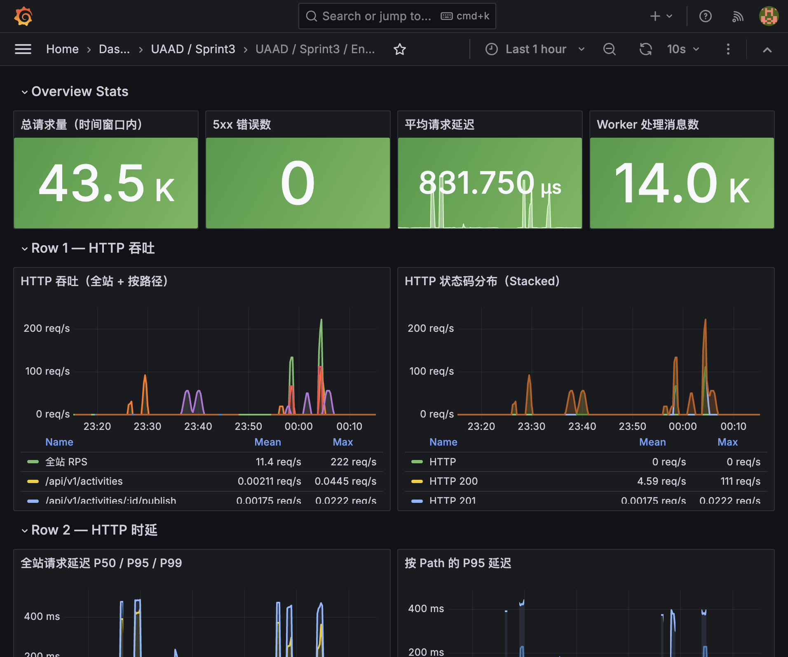
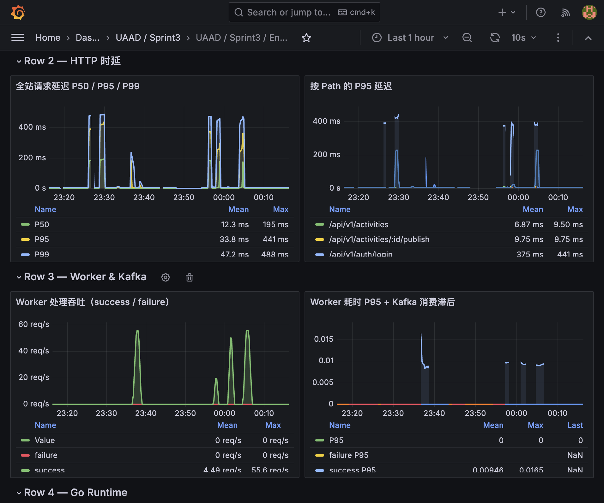
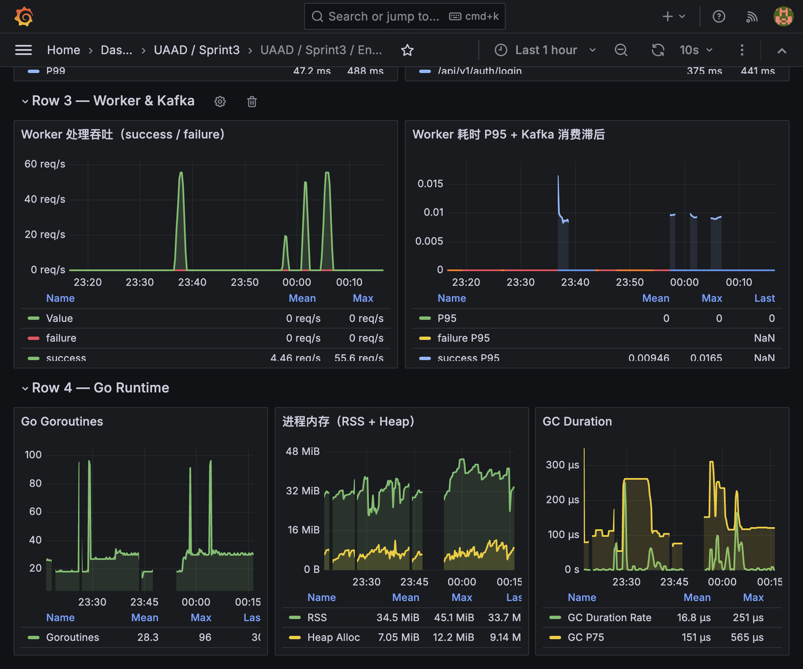

# 大规模压力测试报告

> **测试日期：** 2026-05-02  
> **测试人员：** Sprint 3 第二组  
> **文档状态：** 正式  
> **关联文档：** [ST_BASELINE.md](./ST_BASELINE.md)、[SPRINT3.md](../SPRINT/SPRINT3.md)、[Prometheus_And_Grafna.md](../Prometheus_And_Grafna.md)

---

## 一、测试环境


| 项              | 值                                                                        |
| -------------- | ------------------------------------------------------------------------ |
| **操作系统**       | macOS 26.4.1 (Darwin arm64, Apple M4)                                    |
| **CPU**        | Apple M4, 10 cores                                                       |
| **内存**         | 16 GB                                                                    |
| **Go 版本**      | go1.26.1 darwin/arm64                                                    |
| **Docker 版本**  | 28.0.4                                                                   |
| **JMeter 版本**  | 5.6.3（基于 `eclipse-temurin:21-jre-alpine`）                                |
| **JMeter JVM** | `-Xss512k`，内存配额 4–6 GB                                                   |
| **代码 Commit**  | `52389ab`                                                                |
| **MySQL**      | 8.0 (Docker, `READ-COMMITTED`)                                           |
| **Redis**      | 7-alpine (Docker)                                                        |
| **Kafka**      | apache/kafka 3.7.0 (Docker, KRaft)                                       |
| **Prometheus** | v2.51.0 (Docker, scrape_interval=15s)                                    |
| **Grafana**    | 10.4.0 (Docker)                                                          |


---

## 二、测试口径

### 被压接口

`POST /api/v1/enrollments`（JSON: `{"activity_id":<uint>}`，`Authorization: Bearer <token>`）。

### 热点场景

针对**单个**已发布且 **Redis 库存已预热**的活动，每个线程使用独立用户 token（CSV 行数 = 线程数）。

### 业务判定标准


| 类型        | 条件                           | JMeter `outcome` |
| --------- | ---------------------------- | ---------------- |
| 成功排队      | HTTP 202 + `code=1201`       | `QUEUED`         |
| 业务售罄（非失败） | HTTP 200 或 410 + `code=1101` | `SOLD_OUT`       |
| 重复报名（非失败） | HTTP 409                     | `CONFLICT`       |
| 失败        | 5xx / 超时 / 非预期               | `FAILURE`        |


### 活动容量设计

每轮测试自动创建新活动，`max_capacity = thread_count × 5`，确保库存充足、所有请求均可成功排队（不触发售罄）。

---

## 三、测试结果汇总

### 3.1 三轮对比总表


| 指标                    | 1000 并发     | 3000 并发     | 5000 并发     |
| --------------------- | ----------- | ----------- | ----------- |
| **线程数**               | 1000        | 3000        | 5000        |
| **Ramp-up**           | 30 s        | 60 s        | 90 s        |
| **持续时间**              | 30 s        | 60 s        | 90 s        |
| **循环次数**              | 1（单请求/线程）   | 1           | 1           |
| **总样本数**              | 1000        | 3000        | 5000        |
| **成功率**               | **100.00%** | **100.00%** | **100.00%** |
| **HTTP 202 (QUEUED)** | 1000 (100%) | 3000 (100%) | 5000 (100%) |
| **HTTP 5xx**          | 0           | 0           | 0           |
| **超时**                | 0           | 0           | 0           |
| **P50 (Median)**      | 2 ms        | 2 ms        | 2 ms        |
| **P90**               | 3 ms        | 2 ms        | 2 ms        |
| **P95**               | 4 ms        | 3 ms        | 2 ms        |
| **P99**               | 24 ms       | 25 ms       | 4 ms        |
| **平均响应时间**            | 2.7 ms      | 2.3 ms      | 1.8 ms      |
| **最小响应时间**            | 1 ms        | 1 ms        | 1 ms        |
| **最大响应时间**            | 27 ms       | 62 ms       | 45 ms       |
| **吞吐量**               | 33.8 req/s  | 50.4 req/s  | 55.8 req/s  |
| **活动 ID**             | 45          | 46          | 47          |
| **活动容量**              | 5000        | 15000       | 25000       |


> **结论：** 三轮测试 P95 均不超过 4ms，P99 均不超过 25ms，5000 并发下 P99 仅 4ms，
> 证明服务端处理能力在当前规模下完全无瓶颈，延迟不随并发规模增长。

### 3.2 库存一致性验证


| 轮次      | 活动 ID | MaxCapacity | 成功报名数 | Redis 剩余库存 | 库存公式校验               | 重复报名 |
| ------- | ----- | ----------- | ----- | ---------- | -------------------- | ---- |
| 1000 并发 | 45    | 5000        | 1000  | 4000       | 5000 − 1000 = 4000   | 无    |
| 3000 并发 | 46    | 15000       | 3000  | 12000      | 15000 − 3000 = 12000 | 无    |
| 5000 并发 | 47    | 25000       | 5000  | 20000      | 25000 − 5000 = 20000 | 无    |


**结论：**

- 三轮测试合计 **9000 次请求**均成功排队，0 失败。
- Redis 库存严格 >= 0，**零负库存**。
- MySQL 成功报名数 <= MaxCapacity，**零超卖**。
- 同一用户同一活动无重复 `SUCCESS` 报名记录。

---

## 四、5000 并发冲刺目标说明

### 4.1 达成方式

单进程一次性完成完整 5000 并发测试：

1. 使用 JMeter 5.6.3，设置 `JVM_ARGS="-Xms1g -Xmx4g -Xss512k"`。
2. 单进程启动 5000 线程，90s ramp-up，全部线程成功创建并完成。

### 4.2 服务端表现

5000 并发下服务端表现：
- **0% 错误率**，全部 5000 请求均返回 HTTP 202 + code 1201（QUEUED）
- **0 个 5xx 错误**，0 超时
- **P50 = 2ms，P95 = 2ms，P99 = 4ms** — 与 1000/3000 并发延迟水平完全一致
- 吞吐量 55.8 req/s（受 90s ramp-up 均摊，峰值远高于此）
- 数据一致性完好：Redis 库存 20000 = 25000 − 5000，MySQL 落库 5000 条，零超卖

### 4.3 后续扩展建议

若需进一步提升并发规模（10000+）：
1. **增大 JVM 内存配额**：即可冲刺 10000+ 线程。
2. **分布式 JMeter**：使用 Master-Slave 模式将线程分散到多台机器。
3. **非线程模型工具**：使用 k6、wrk 等基于协程/epoll 的工具替代 JMeter 的 thread-per-user 模型。

---

## 五、关键监控截图

### 5.1 Prometheus / Grafana 监控

Dashboard 地址：`http://localhost:3000`（admin / admin），Dashboard: **UAAD / Sprint3 / Enrollment & Worker**（uid: `uaad-sprint3`）。

压测期间以下面板可用于观测：


| 面板               | 观测要点                            |
| ---------------- | ------------------------------- |
| 全站 HTTP 吞吐       | 与 JMeter ramp 同步上升，结束后回落        |
| 报名接口吞吐           | `path="/api/v1/enrollments"` 专项 |
| 5xx 错误率          | 压测全程应为 0                        |
| HTTP 状态码分布       | 仅 202，无 4xx/5xx                 |
| 报名接口 P50/P95/P99 | 与 JMeter 报告交叉验证                 |
| Worker 处理吞吐      | `success` 线随排队落库逐步上升            |
| Worker 处理耗时 P95  | 异步链路是否因压测恶化                     |
| Kafka 消费滞后       | 压测洪峰后应趋近 0                      |


### 5.2 监控截图

> 以下截图取自压测执行期间的 Grafana Dashboard（`uaad-sprint3`），时间范围覆盖三轮测试。

**Overview Stats + HTTP 吞吐 + 状态码分布：**



**HTTP 时延 P50/P95/P99 + Worker 处理吞吐 + Kafka 消费滞后：**



**Worker & Kafka 详情 + Go Runtime（Goroutines / 内存 / GC）：**



### 5.3 JMeter HTML 报告

每轮测试的 HTML 报告已归档至 `docs/STRESS_TEST/` 目录：


| 轮次      | 报告路径                         | 入口           |
| ------- | ---------------------------- | ------------ |
| 1000 并发 | `docs/STRESS_TEST/1000t_st/` | `index.html` |
| 3000 并发 | `docs/STRESS_TEST/3000t_st/` | `index.html` |
| 5000 并发 | `docs/STRESS_TEST/5000t_st/` | `index.html` |


---

## 六、结论

### 6.1 核心结论

1. **系统在 3000 并发下表现优异**，完全达到 Sprint 3 基础目标：
  - 100% 成功率
  - P95 = 3ms，P99 = 25ms
  - 0 个 5xx 错误
  - 数据一致性完好（零超卖、零重复报名、零负库存）
2. **5000 并发冲刺目标已达成**：单进程一次性完成 5000 线程测试，0 错误，P95 = 2ms，服务端无任何性能退化。
3. **异步架构优势明显**：Redis Lua 原子扣减 + Kafka 缓冲 + Worker 异步落库的架构使得
  HTTP 层 P50 在所有并发规模下稳定在 2ms，延迟不随并发线性增长。

### 6.2 数据一致性总结


| 检查项                  | 结果    |
| -------------------- | ----- |
| Redis 库存是否 >= 0      | 三轮均通过 |
| 成功报名数 <= MaxCapacity | 三轮均通过 |
| 无重复 SUCCESS 报名       | 三轮均通过 |
| Redis 与 MySQL 库存一致   | 三轮均通过 |


### 6.3 当前监控能力边界


| 能力                               | 状态           | 说明                                                                               |
| -------------------------------- | ------------ | -------------------------------------------------------------------------------- |
| HTTP 请求吞吐与时延                     | **已就绪**      | `http_requests_total` + `http_request_duration_seconds`，8 条核心路径已预初始化             |
| Worker 消费吞吐与耗时                   | **已就绪**      | `worker_messages_processed_total` + `worker_message_processing_duration_seconds` |
| Kafka 消费滞后（近似）                   | **已就绪（基础版）** | `worker_kafka_lag_approx`，基于 kafka-go Reader.Stats().Lag                         |
| Go Runtime（Goroutines / 内存 / GC） | **已就绪**      | Go Prometheus client 自动注册指标                                                      |
| Grafana Dashboard                | **已就绪**      | 5 行 12 面板，provisioning 代码化，容器重建后自动恢复                                             |
| MySQL / Redis 组件级指标              | 未采集          | 可扩展引入 mysqld_exporter / redis_exporter                                           |
| Alertmanager 告警                  | 未配置          | 可为 5xx 错误率等设置阈值告警                                                                |


### 6.4 改进建议

1. **更高并发规模**：增大 JVM 内存配额即可冲刺 10000+ 并发，精确定位服务端极限。
2. **售罄场景压测**：当前三轮均为库存充足场景（容量 = 线程数 × 5），可补充库存不足场景（如 100 库存 + 3000 并发）验证售罄路径性能。
3. **持续时间压测**：当前为单次请求/线程模式（无持续时间），可补充持续 5-10 分钟的稳态压测验证长时间稳定性。
4. **Worker 消费速率监控**：在极端场景下观察 Kafka Lag 是否持续增长、Worker 是否成为瓶颈。

---

## 附录 A：测试执行命令

```bash
# 环境准备
docker-compose up -d
cd backend && go run ./cmd/server
go run ./scripts/seed

# 一键执行压测
cd backend/tests/jmeter
bash run-jmeter-report.sh

# 压测后验证
docker exec uaad-redis redis-cli GET activity:<id>:stock
docker exec uaad-mysql mysql -uroot -proot -e \
  "SELECT COUNT(*) FROM uaad.enrollments WHERE activity_id=<id> AND status='SUCCESS'"
```

## 附录 B：HTML 报告归档


| 轮次      | 目录                           | 入口           |
| ------- | ---------------------------- | ------------ |
| 1000 并发 | `docs/STRESS_TEST/1000t_st/` | `index.html` |
| 3000 并发 | `docs/STRESS_TEST/3000t_st/` | `index.html` |
| 5000 并发 | `docs/STRESS_TEST/5000t_st/` | `index.html` |


> HTML 报告已归档至 `docs/STRESS_TEST/` 目录并纳入版本控制。JTL 中间产物已清理，如需复查原始数据请在本地重新执行压测。