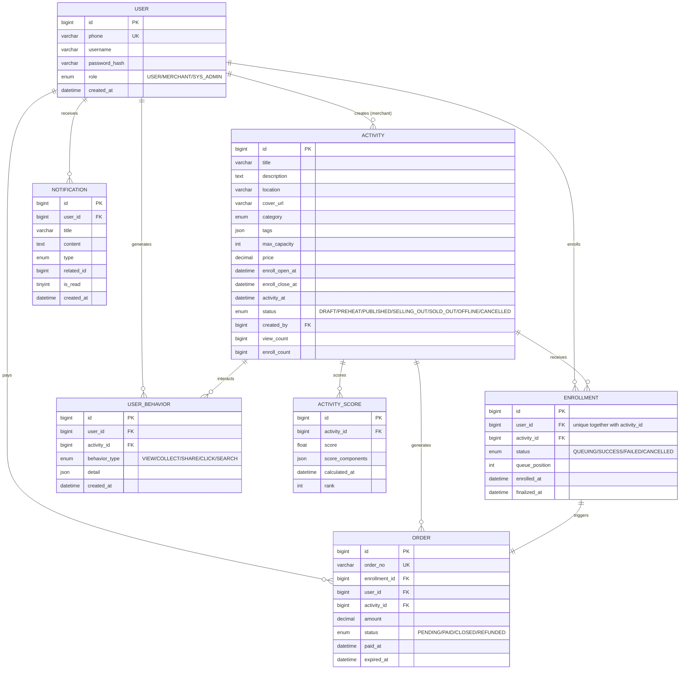

# UAAD 系统架构设计文档 v1.1
# System Architecture Design

**面向范围：** Layer 1（抢票引擎）+ Layer 2（活动平台）+ Layer 3（智能分发）

| 文档属性 | 内容 |
|---|---|
| 文档版本 | v1.1 |
| 编制日期 | 2026-04-18 |
| 状态 | 已按当前代码同步（Synced with Repository） |
| 替代 | SRS v2.0（本文档在 SRS 基础上进行工程级细化） |

---

## 目录

1. 总体架构总览
2. 系统分层与组件职责
3. 完整数据库 DDL（物理层）
4. 全量 API 契约（含请求/响应/错误码）
5. 核心业务流程详解（含时序图）
6. 抢票引擎深度设计
7. 推荐系统设计
8. 错误处理与状态码规范
9. 安全设计
10. 部署与运维架构
11. 前端页面路由与数据流
12. 演进里程碑

---

## 1. 总体架构总览

### 1.1 架构风格

UAAD 采用 **分层 + 事件驱动** 混合架构：

```
┌─────────────────────────────────────────────────────────┐
│                    CDN / 静态资源层                      │
│         前端 SPA 打包产物 + 活动封面图等媒体              │
├─────────────────────────────────────────────────────────┤
│                   API Gateway / LB 层                    │
│           Nginx reverse proxy → Go API Server           │
├──────────────┬──────────────┬───────────────────────────┤
│  认证服务     │  活动服务     │  报名/抢票服务             │
│  Auth Module  │  Activity    │  Enrollment Module         │
│  (同步/有状态) │  Module      │  (异步/事件驱动)            │
│              │  (同步/缓存)  │                            │
├──────────────┴──────────────┴───────────────────────────┤
│                    中间件层                               │
│        Redis Cluster  │  Kafka Cluster                  │
│     (缓存 + 原子扣减) │  (异步消息队列)                    │
├─────────────────────────────────────────────────────────┤
│                   数据存储层                              │
│        MySQL（主链路） + Redis + Kafka + 本地 Mock        │
└─────────────────────────────────────────────────────────┘
```

### 1.2 模块划分

| 模块 | 代号 | 职责 | 当前状态 |
|---|---|---|---|
| 认证模块 | AUTH | 注册、登录、Token 签发与校验 | ✅ 已实现，含 `profile` 查询 |
| 活动模块 | ACTIVITY | 活动 CRUD、详情、库存查询、商户活动管理 | ✅ 已实现 |
| 报名模块 | ENROLLMENT | 抢票排队、状态查询、报名列表 | ✅ 已实现，异步入队 |
| 订单模块 | ORDER | 订单列表、详情、支付、过期关闭 | ✅ 已实现 |
| 推荐模块 | RECOMMEND | 用户行为采集、热度评分、个性化推荐 | ✅ 已实现，含 Hot + Cold Fill + CF |
| 通知模块 | NOTIFICATION | 站内消息、未读数、标记已读 | ✅ 已实现 |
| 网关中间件 | GATEWAY | JWT、Optional JWT、RBAC、限流、Prometheus 指标 | ✅ 已实现 |

---

## 2. 系统分层与组件职责

### 2.1 Backend 内部架构（Clean Architecture 变体）

```text
backend/
├── cmd/server/main.go          # 入口：依赖注入、路由装配、后台 goroutine 启动
├── internal/
│   ├── config/                 # 环境变量、MySQL 连接池、推荐参数
│   ├── domain/                 # user/activity/enrollment/order/notification/behavior/activity_score
│   ├── handler/                # auth/activity/enrollment/order/notification/behavior/recommendation
│   ├── infra/                  # Redis / Kafka client 封装
│   ├── middleware/             # JWT、Optional JWT、Role、Rate Limit、Metrics
│   ├── repository/             # 各业务仓储
│   ├── service/                # 认证、活动、报名、订单、通知、行为、推荐、库存 Lua
│   └── worker/                 # EnrollmentWorker（Kafka consumer）
├── migrations/                 # 001~007 up/down SQL
├── pkg/                        # response / jwtutil
├── scripts/                    # seed / gen_jmeter_data
├── tests/                      # integration / response contract / stress / jmeter
├── go.mod
└── go.sum
```

> **关键设计决策：**
> - 保持 `internal/` 层级结构，遵循项目已有的 Clean Architecture 分层
> - `handler` 只负责 HTTP 协议层——解析请求体 → 调用 service → 格式化响应
> - `service` 层是业务核心——所有规则校验、状态转换、外部依赖调用都在这里
> - `repository` 层只做数据读写——一个接口对应一个实体表
> - `pkg/` 存放跨复用的工具，避免 service 层重复造轮子

### 2.2 Frontend 组件层级

```text
frontend/src/
├── api/
│   ├── axios.ts               # Axios 实例 + Bearer Token / 401 处理
│   └── endpoints/             # auth / activities / enrollments / orders / notifications / recommendations
├── components/
│   ├── merchant/              # MerchantNotice / MerchantPageHeader / MerchantStateCard
│   ├── public/                # BannerCarousel / NotificationBell / RecommendationList / Pagination 等
│   ├── ActivityCountdown.tsx  # 抢票倒计时
│   ├── LanguageToggle.tsx     # 中英文切换
│   ├── MerchantForm.tsx       # 商户活动表单
│   └── ProtectedRoute.tsx     # 登录与角色保护
├── constants/                 # 认证事件与公共常量
├── context/AuthContext.tsx    # 认证全局状态
├── data/                      # 首页展示数据、地理映射
├── hooks/                     # 通知数、城市偏好、用户偏好、头像对象 URL
├── i18n/                      # 配置 + zh/en 词典
├── layouts/PublicLayout.tsx   # 公共站点布局
├── mocks/                     # MSW handlers
├── pages/                     # Home / PublicActivities / ActivityDetail / Orders / Notifications / Merchant*
├── types/                     # 各模块 TypeScript 类型
├── utils/                     # auth / formatters / notificationState / activityCountdown 等
├── App.tsx                    # 路由入口 + 旧路径重定向
└── main.tsx                   # 启动入口 + 可选 Mock
```

> **前端关键规则：**
> - 新增 API 调用必须通过 `api/endpoints/` 下的函数，禁止直接在页面组件里 `axios.post()`
> - 所有页面文案必须走 i18n `t()` 函数，同时更新 `zh.json` 和 `en.json`
> - Mock 策略保持：auth 接口 `bypass`（走真实后端），其余模块在 MSW 中 Mock

---

## 3. 完整数据库 DDL（物理层）

> 以下为 **MySQL 主开发链路 DDL**，当前服务端通过 GORM AutoMigrate 对齐同一套实体结构。
> 仓库中保留的 SQLite 文件仅作为本地样例产物，不再作为当前默认运行链路。

### 3.1 核心用户表 `users`

```sql
CREATE TABLE `users` (
  `id`             BIGINT       NOT NULL AUTO_INCREMENT,
  `phone`          VARCHAR(20)  NOT NULL,
  `username`       VARCHAR(50)  NOT NULL,
  `password_hash`  VARCHAR(255) NOT NULL,
  `role`           ENUM('USER','MERCHANT','SYS_ADMIN') NOT NULL DEFAULT 'USER',
  `created_at`     DATETIME     NOT NULL DEFAULT CURRENT_TIMESTAMP,
  `updated_at`     DATETIME     NOT NULL DEFAULT CURRENT_TIMESTAMP ON UPDATE CURRENT_TIMESTAMP,
  `deleted_at`     DATETIME     DEFAULT NULL,
  PRIMARY KEY (`id`),
  UNIQUE KEY `uk_phone` (`phone`),
  KEY `idx_role` (`role`),
  KEY `idx_deleted_at` (`deleted_at`)
) ENGINE=InnoDB DEFAULT CHARSET=utf8mb4 COLLATE=utf8mb4_general_ci
COMMENT='核心用户表——手机号为唯一身份标识';
```

### 3.2 活动表 `activities`

```sql
CREATE TABLE `activities` (
  `id`             BIGINT       NOT NULL AUTO_INCREMENT,
  `title`          VARCHAR(200) NOT NULL,
  `description`    TEXT         NOT NULL,
  `cover_url`      VARCHAR(500) DEFAULT NULL COMMENT '活动封面图片 URL',
  `location`       VARCHAR(200) NOT NULL COMMENT '活动地点',
  `latitude`       DECIMAL(10,7) DEFAULT NULL COMMENT '纬度（可选，用于 LBS 计算）',
  `longitude`      DECIMAL(10,7) DEFAULT NULL COMMENT '经度',
  `category`       ENUM('CONCERT','CONFERENCE','EXPO','ESPORTS','EXHIBITION','OTHER') NOT NULL DEFAULT 'OTHER',
  `tags`           JSON         DEFAULT NULL COMMENT '标签数组，如 ["科技","AI"]',
  `max_capacity`   INT          NOT NULL DEFAULT 0 COMMENT '总库存量（门票数量）',
  `enroll_open_at` DATETIME     NOT NULL COMMENT '抢票开始时间',
  `enroll_close_at` DATETIME    NOT NULL COMMENT '抢票截止时间',
  `activity_at`    DATETIME     NOT NULL COMMENT '活动线下举办时间',
  `price`          DECIMAL(10,2) NOT NULL DEFAULT 0.00 COMMENT '票价',
  `status`         ENUM('DRAFT','PREHEAT','PUBLISHED','SELLING_OUT','SOLD_OUT','OFFLINE','CANCELLED') NOT NULL DEFAULT 'DRAFT'
                   COMMENT 'DRAFT=草稿 PREHEAT=预热 PUBLISHED=已上架 SELLING_OUT=售罄中 SOLD_OUT=已售罄 OFFLINE=已结束 CANCELLED=已取消',
  `created_by`     BIGINT       NOT NULL COMMENT '商户用户 UID (FK → users.id, role=MERCHANT)',
  `view_count`     BIGINT       NOT NULL DEFAULT 0 COMMENT '浏览次数（用于热度计算）',
  `enroll_count`   BIGINT       NOT NULL DEFAULT 0 COMMENT '已报名人数（异步落盘后递增）',
  `created_at`     DATETIME     NOT NULL DEFAULT CURRENT_TIMESTAMP,
  `updated_at`     DATETIME     NOT NULL DEFAULT CURRENT_TIMESTAMP ON UPDATE CURRENT_TIMESTAMP,
  `deleted_at`     DATETIME     DEFAULT NULL,
  PRIMARY KEY (`id`),
  KEY `idx_status` (`status`),
  KEY `idx_category` (`category`),
  KEY `idx_enroll_open` (`enroll_open_at`),
  KEY `idx_created_by` (`created_by`),
  KEY `idx_deleted_at` (`deleted_at`)
) ENGINE=InnoDB DEFAULT CHARSET=utf8mb4 COLLATE=utf8mb4_general_ci
COMMENT='大型活动主表——库存与状态管控';
```

### 3.3 Redis 库存键位约定（非 SQL 表，但作为"逻辑表"记录）

抢票引擎中的**真实库存**维护在 Redis 中，MySQL 仅作为持久化兜底：

| Redis 键 | 类型 | 说明 |
|---|---|---|
| `activity:{id}:stock` | STRING (INT) | 当前剩余可抢库存（由 `enroll` 扣减和 `order_worker` 补偿） |
| `activity:{id}:sold` | STRING (INT) | 已售数量（辅助监控） |
| `activity:{id}:warmup` | STRING (BOOL) | 是否已完成缓存预热 |

### 3.4 报名记录表 `enrollments`

```sql
CREATE TABLE `enrollments` (
  `id`             BIGINT       NOT NULL AUTO_INCREMENT,
  `user_id`        BIGINT       NOT NULL,
  `activity_id`    BIGINT       NOT NULL,
  `status`         ENUM('QUEUING','SUCCESS','FAILED','CANCELLED') NOT NULL DEFAULT 'QUEUING'
                   COMMENT 'QUEUING=排队中 SUCCESS=成功 FAILED=失败(库存不足/异常) CANCELLED=用户取消',
  `queue_position` INT          DEFAULT NULL COMMENT '队列位置（用于排队进度显示）',
  `enrolled_at`    DATETIME     NOT NULL DEFAULT CURRENT_TIMESTAMP,
  `finalized_at`   DATETIME     DEFAULT NULL COMMENT '状态从 QUEUING → SUCCESS/FAILED 的时间',
  PRIMARY KEY (`id`),
  UNIQUE KEY `uk_user_activity` (`user_id`, `activity_id`)
                   COMMENT '每个用户对每个活动只能报名一次（幂等保证）',
  KEY `idx_user_id` (`user_id`),
  KEY `idx_activity_id` (`activity_id`),
  KEY `idx_status` (`status`)
) ENGINE=InnoDB DEFAULT CHARSET=utf8mb4 COLLATE=utf8mb4_general_ci
COMMENT='活动报名表——异步排队与最终一致性';
```

### 3.5 订单表 `orders`

> 抢票成功 → 生成订单。订单表与 `enrollments` 分离，以便扩展支付、退款等后续功能。

```sql
CREATE TABLE `orders` (
  `id`             BIGINT        NOT NULL AUTO_INCREMENT,
  `order_no`       VARCHAR(32)   NOT NULL COMMENT '订单号 (格式: ORD{YYYYMMDD}{8位序列})',
  `enrollment_id`  BIGINT        NOT NULL,
  `user_id`        BIGINT        NOT NULL,
  `activity_id`    BIGINT        NOT NULL,
  `amount`         DECIMAL(10,2) NOT NULL COMMENT '应付金额 = 活动票价',
  `status`         ENUM('PENDING','PAID','CLOSED','REFUNDED') NOT NULL DEFAULT 'PENDING',
  `paid_at`        DATETIME      DEFAULT NULL,
  `expired_at`     DATETIME      NOT NULL COMMENT '支付过期时间 (创建后 + 15分钟)',
  `created_at`     DATETIME      NOT NULL DEFAULT CURRENT_TIMESTAMP,
  `updated_at`     DATETIME      NOT NULL DEFAULT CURRENT_TIMESTAMP ON UPDATE CURRENT_TIMESTAMP,
  PRIMARY KEY (`id`),
  UNIQUE KEY `uk_order_no` (`order_no`),
  UNIQUE KEY `uk_enrollment_id` (`enrollment_id`)
                   COMMENT '一个报名记录对应一个订单',
  KEY `idx_user_id` (`user_id`),
  KEY `idx_activity_id` (`activity_id`),
  KEY `idx_status_expired` (`status`, `expired_at`)
                   COMMENT '用于过期订单扫描 Worker',
  KEY `idx_created_at` (`created_at`)
) ENGINE=InnoDB DEFAULT CHARSET=utf8mb4 COLLATE=utf8mb4_general_ci
COMMENT='订单表——从报名成功到支付完成';
```

### 3.6 用户行为流水表 `user_behaviors`

> 用于推荐系统。写入量大，采用异步落盘策略。

```sql
CREATE TABLE `user_behaviors` (
  `id`             BIGINT       NOT NULL AUTO_INCREMENT,
  `user_id`        BIGINT       NOT NULL,
  `activity_id`    BIGINT       NOT NULL,
  `behavior_type`  ENUM('VIEW','COLLECT','SHARE','CLICK','SEARCH') NOT NULL
                   COMMENT '行为类型：VIEW=浏览 DETAIL=查看详情 COLLECT=收藏 SHARE=分享 SEARCH=搜索',
  `detail`         JSON         DEFAULT NULL COMMENT '行为附加信息（如搜索关键词、停留秒数）',
  `created_at`     DATETIME     NOT NULL DEFAULT CURRENT_TIMESTAMP,
  PRIMARY KEY (`id`),
  KEY `idx_user_activity_type` (`user_id`, `activity_id`, `behavior_type`),
  KEY `idx_created_at` (`created_at`)
) ENGINE=InnoDB DEFAULT CHARSET=utf8mb4 COLLATE=utf8mb4_general_ci
COMMENT='用户行为流水——推荐系统数据源';
```

### 3.7 活动热度评分表 `activity_scores`

> 定时计算（离线批处理）+ 近实时更新（事件触发更新）。

```sql
CREATE TABLE `activity_scores` (
  `id`               BIGINT    NOT NULL AUTO_INCREMENT,
  `activity_id`      BIGINT    NOT NULL,
  `score`            FLOAT     NOT NULL DEFAULT 0.0 COMMENT '综合热度分数（越高越热门）',
  `score_components` JSON      NOT NULL COMMENT '评分明细: {"view_weight": x, "enroll_weight": y, "time_decay": z}',
  `calculated_at`    DATETIME  NOT NULL DEFAULT CURRENT_TIMESTAMP,
  `rank`             INT       NOT NULL DEFAULT 0 COMMENT '全站排名',
  PRIMARY KEY (`id`),
  UNIQUE KEY `uk_activity_id` (`activity_id`),
  KEY `idx_score` (`score` DESC)
) ENGINE=InnoDB DEFAULT CHARSET=utf8mb4 COLLATE=utf8mb4_general_ci
COMMENT='活动热度评分——推荐/排序引擎核心';
```

### 3.8 站内消息表 `notifications`

```sql
CREATE TABLE `notifications` (
  `id`             BIGINT       NOT NULL AUTO_INCREMENT,
  `user_id`        BIGINT       NOT NULL,
  `title`          VARCHAR(200) NOT NULL,
  `content`        TEXT         NOT NULL,
  `type`           ENUM('ENROLL_SUCCESS','ENROLL_FAIL','ORDER_EXPIRE','ACTIVITY_REMINDER') NOT NULL,
  `related_id`     BIGINT       DEFAULT NULL COMMENT '关联 ID（如 enrollment_id, order_id）',
  `is_read`        TINYINT(1)   NOT NULL DEFAULT 0,
  `created_at`     DATETIME     NOT NULL DEFAULT CURRENT_TIMESTAMP,
  PRIMARY KEY (`id`),
  KEY `idx_user_id_read` (`user_id`, `is_read`),
  KEY `idx_created_at` (`created_at`)
) ENGINE=InnoDB DEFAULT CHARSET=utf8mb4 COLLATE=utf8mb4_general_ci
COMMENT='站内通知——签收通知等推送';
```

### 3.9 ER 关系图（完整版）



---

## 4. 全量 API 契约

### 4.1 通用约定

| 项 | 说明 |
|---|---|
| **Base URL** | `http://{host}/api/v1` |
| **认证方式** | `Authorization: Bearer {JWT}` 请求头 |
| **请求/响应格式** | `application/json` (UTF-8) |
| **时区** | 所有时间字段使用 ISO 8601 UTC 格式: `2026-04-01T12:00:00Z` |
| **分页** | `GET ?page=1&page_size=20`，响应包含 `total`, `page`, `page_size` |

### 4.2 统一响应格式

**成功响应：**
```json
{
  "code": 0,
  "message": "ok",
  "data": { ... }
}
```

**失败响应：**
```json
{
  "code": 1001,
  "message": "手机号格式无效",
  "data": null
}
```

**分页列表响应：**
```json
{
  "code": 0,
  "message": "ok",
  "data": {
    "list": [ { ... }, { ... } ],
    "total": 156,
    "page": 1,
    "page_size": 20
  }
}
```

### 4.3 全局错误码表

| Code | HTTP Status | 含义 | 典型场景 |
|---|---|---|---|
| 0 | 200 | 成功 | — |
| 1001 | 400 | 请求参数错误 | 手机号格式不对、必填字段缺漏 |
| 1002 | 401 | 未认证 / Token 过期 | Token 无效或已过期 |
| 1003 | 403 | 权限不足 | 用户角色不匹配（非商户创建活动） |
| 1004 | 404 | 资源不存在 | 活动 ID 不存在 |
| 1005 | 409 | 资源冲突 | 重复注册、重复报名 |
| 1006 | 429 | 请求过快 | 触发限流 |
| 1101 | 410 | 活动已过期 | 活动已下线或抢票窗口已关闭 |
| 1201 | 503 | 排队中 | 报名请求进入排队队列 |
| 5000 | 500 | 内部服务器错误 | 未知错误 |

---

### 4.4 认证模块 AUTH

#### `POST /auth/register` — 用户注册

| 属性 | 说明 |
|---|---|
| **限流** | IP 级：5 次/分钟；用户级（按手机号）：3 次/小时（Redis 存储） |
| **认证** | 无 |

**请求体：**
```json
{
  "phone": "13800138000",
  "username": "张三",
  "password": "MyP@ssw0rd"
}
```

**响应 201：**
```json
{
  "code": 0,
  "message": "注册成功",
  "data": {
    "user_id": 1,
    "phone": "13800138000",
    "username": "张三"
  }
}
```

**错误响应：**
| Code | 场景 |
|---|---|
| 1001 | 手机号格式不合法（非中国大陆手机号） |
| 1005 | 手机号已注册 |
| 1006 | 请求过快（限流） |

---

#### `POST /auth/login` — 用户登录

| 属性 | 说明 |
|---|---|
| **认证** | 无 |

**请求体：**
```json
{
  "phone": "13800138000",
  "password": "MyP@ssw0rd"
}
```

**响应 200：**
```json
{
  "code": 0,
  "message": "登录成功",
  "data": {
    "token": "eyJhbGciOiJIUzI1NiIs...",
    "expires_at": "2026-04-04T12:00:00Z",
    "user_id": 1,
    "role": "USER",
    "username": "张三"
  }
}
```

---

#### `POST /auth/refresh` — Token 刷新

> 当前 JWT 过期时间为 72h，建议在 v1.0 实现 Access Token (2h) + Refresh Token (7d) 双令牌机制。

| 属性 | 说明 |
|---|---|
| **认证** | Need Bearer Token |

**响应 200：**
```json
{
  "code": 0,
  "message": "刷新成功",
  "data": {
    "token": "eyJhbGciOiJIUzI1NiIs..."
  }
}
```

---

#### `GET /auth/profile` — 获取当前用户信息

| 属性 | 说明 |
|---|---|
| **认证** | Need Bearer Token |

**响应 200：**
```json
{
  "code": 0,
  "message": "ok",
  "data": {
    "user_id": 1,
    "phone": "13800138000",
    "username": "张三",
    "role": "USER",
    "created_at": "2026-03-20T08:30:00Z"
  }
}
```

---

#### `PUT /auth/profile` — 更新用户资料

| 属性 | 说明 |
|---|---|
| **认证** | Need Bearer Token |

**请求体：**
```json
{
  "username": "新昵称"
}
```

> 手机号和密码不可通过此接口修改（需专门的密码重置流程）。

---

### 4.5 活动模块 ACTIVITY

#### `POST /activities` — 创建活动（B 端）

| 属性 | 说明 |
|---|---|
| **认证** | Need Bearer Token (role=MERCHANT) |

**请求体：**
```json
{
  "title": "2026 全球 AI 开发者峰会",
  "description": "全球顶级 AI 技术盛宴...",
  "cover_url": "https://cdn.example.com/cover/ai2026.jpg",
  "location": "上海国际会展中心",
  "latitude": 31.2304,
  "longitude": 121.4737,
  "category": "CONFERENCE",
  "tags": ["科技", "AI", "开发者"],
  "max_capacity": 50000,
  "price": 299.00,
  "enroll_open_at": "2026-04-10T10:00:00Z",
  "enroll_close_at": "2026-04-20T23:59:59Z",
  "activity_at": "2026-05-15T09:00:00Z"
}
```

**响应 201：**
```json
{
  "code": 0,
  "message": "活动创建成功",
  "data": {
    "activity_id": 1,
    "status": "DRAFT"
  }
}
```

---

#### `PUT /activities/:id` — 更新活动（B 端）

| 属性 | 说明 |
|---|---|
| **认证** | Need Bearer Token (role=MERCHANT, created_by=当前用户) |
| **约束** | 状态为 `PUBLISHED` 或之后不允许修改 `max_capacity` 和 `enroll_open_at` |

---

#### `PUT /activities/:id/preheat` — 设为预热（B 端）

| 属性 | 说明 |
|---|---|
| **认证** | Need Bearer Token (role=MERCHANT) |
| **业务逻辑** | 仅活动创建者可操作；状态从 `DRAFT` → `PREHEAT`；不触发 Redis 库存预热，仍允许继续编辑库存和报名开始时间 |

**响应 200：**
```json
{
  "code": 0,
  "message": "活动已进入预热状态",
  "data": {
    "activity_id": 1,
    "status": "PREHEAT"
  }
}
```

---

#### `PUT /activities/:id/publish` — 上架活动（B 端）

| 属性 | 说明 |
|---|---|
| **认证** | Need Bearer Token (role=MERCHANT) |
| **业务逻辑** | 1) 状态从 DRAFT/PREHEAT → PUBLISHED; 2) 触发 Redis 预热: 写入 `activity:{id}:stock = max_capacity` |

**响应 200：**
```json
{
  "code": 0,
  "message": "活动已上架，库存预热完成",
  "data": {
    "activity_id": 1,
    "status": "PUBLISHED",
    "stock_in_cache": 50000
  }
}
```

---

#### `GET /activities` — 活动列表（C 端）

| 属性 | 说明 |
|---|---|
| **认证** | 公开（可匿名浏览） |
| **查询参数** | `category`, `status`, `keyword` (名称/描述模糊), `region` (地区/城市模糊), `artist` (艺人/标签模糊), `sort` (relevance/hot/recent/soon), `page`, `page_size` |

**查询规则：**
- 非空筛选项采用 **AND** 关系：`keyword + region + artist + category` 同时生效
- `keyword` 用于活动名称和描述模糊匹配
- `region` 用于 `location` 中的城市/地区模糊匹配
- `artist` 在 v1.0 首期使用 `tags` 与标题中的艺人名进行模糊匹配，不新增独立字段
- `sort=relevance` 时，默认按“名称完全命中 > 名称包含 > 艺人标签/标题命中 > 地区命中 > 描述命中 > 热门度”的顺序排序

**请求示例：** `GET /api/v1/activities?category=CONCERT&region=北京&artist=张杰&keyword=巡演&sort=relevance&page=1&page_size=20`

**响应 200：**
```json
{
  "code": 0,
  "message": "ok",
  "data": {
    "list": [
      {
        "activity_id": 3,
        "title": "五月天 2026 巡回演唱会·上海站",
        "cover_url": "https://cdn.example.com/cover/mayday.jpg",
        "location": "上海体育场",
        "category": "CONCERT",
        "price": 480.00,
        "enroll_open_at": "2026-04-10T10:00:00Z",
        "max_capacity": 80000,
        "enroll_count": 67234,
        "status": "SELLING_OUT",
        "score": 98.5,
        "rank": 1
      }
    ],
    "total": 156,
    "page": 1,
    "page_size": 20
  }
}
```

---

#### `GET /activities/:id` — 活动详情（C 端）

| 属性 | 说明 |
|---|---|
| **认证** | 公开 |
| **性能** | 读取走 Redis 缓存（TTL 30min → 1h）；DB 是最终数据源 |
| **副作用** | 异步写入 `user_behaviors`（如果已登录） |

**响应 200：**
```json
{
  "code": 0,
  "message": "ok",
  "data": {
    "activity_id": 3,
    "title": "五月天 2026 巡回演唱会·上海站",
    "description": "五月天 2026 巡回演唱会上海站，12 首金曲重编...",
    "cover_url": "https://cdn.example.com/cover/mayday.jpg",
    "location": "上海体育场",
    "latitude": 31.2304,
    "longitude": 121.4737,
    "category": "CONCERT",
    "tags": ["音乐", "演唱会", "五月天"],
    "max_capacity": 80000,
    "price": 480.00,
    "enroll_open_at": "2026-04-10T10:00:00Z",
    "enroll_close_at": "2026-04-20T23:59:59Z",
    "activity_at": "2026-05-20T19:00:00Z",
    "status": "SELLING_OUT",
    "enroll_count": 67234,
    "stock_remaining": 12766,
    "created_by": 10
  }
}
```

---

#### `GET /activities/:id/stock` — 实时库存查询（C 端）

| 属性 | 说明 |
|---|---|
| **认证** | 公开 |
| **数据源** | 直接读 Redis `activity:{id}:stock`，不经过 DB |
| **用途** | 前端抢票页面的实时库存展示 |

**响应 200：**
```json
{
  "code": 0,
  "message": "ok",
  "data": {
    "activity_id": 3,
    "stock_remaining": 12766,
    "max_capacity": 80000
  }
}
```

---

#### `GET /activities/merchant` — 商户的我的活动列表（B 端）

| 属性 | 说明 |
|---|---|
| **认证** | Need Bearer Token (role=MERCHANT) |

---

### 4.6 报名/抢票模块 ENROLLMENT

#### `POST /enrollments` — 提交报名（抢票）

| 属性 | 说明 |
|---|---|
| **认证** | Need Bearer Token |
| **限流** | 用户级：10 次/活动窗口（防同一用户反复刷接口） |
| **核心逻辑** | Redis Lua 原子扣减 → 202 Accepted 进入排队 |

**请求体：**
```json
{
  "activity_id": 3
}
```

**响应 202 Accepted（排队中）：**
```json
{
  "code": 1201,
  "message": "已进入排队队列，请等待结果",
  "data": {
    "enrollment_id": 100156,
    "status": "QUEUING",
    "queue_position": 3482
  }
}
```

**响应 200（库存不足，直接拒绝）：**
```json
{
  "code": 1101,
  "message": "库存不足，该活动已售罄",
  "data": {
    "activity_id": 3,
    "stock_remaining": 0
  }
}
```

**响应 409（重复报名）：**
```json
{
  "code": 1005,
  "message": "您已对该活动提交报名，无需重复操作",
  "data": null
}
```

---

#### `GET /enrollments/:id/status` — 查询报名状态

| 属性 | 说明 |
|---|---|
| **认证** | Need Bearer Token |
| **调用频率** | 前端每 3-5 秒轮询（或 WebSocket 推送后停止轮询） |

**响应 200（排队中）：**
```json
{
  "code": 0,
  "message": "ok",
  "data": {
    "enrollment_id": 100156,
    "activity_id": 3,
    "activity_title": "五月天 2026 巡回演唱会·上海站",
    "status": "QUEUING",
    "queue_position": 2103,
    "submitted_at": "2026-04-10T10:00:03Z"
  }
}
```

**响应 200（排队成功）：**
```json
{
  "code": 0,
  "message": "ok",
  "data": {
    "enrollment_id": 100156,
    "status": "SUCCESS",
    "order_no": "ORD2026041000001234",
    "finalized_at": "2026-04-10T10:00:28Z"
  }
}
```

---

#### `POST /enrollments/:id/cancel` — 取消报名（排队/未支付）

| 属性 | 说明 |
|---|---|
| **认证** | Need Bearer Token |
| **支持状态** | `QUEUING` 或 `SUCCESS + PENDING` 订单 |
| **副作用** | 关闭未支付订单并回补库存；排队中报名直接回补库存 |

**响应 200：**
```json
{
  "code": 0,
  "message": "ok",
  "data": {
    "enrollment_id": 100156,
    "status": "CANCELLED"
  }
}
```

**响应 400：** 当前状态不可取消（如已支付/已关闭）

---

#### `GET /enrollments` — 我的报名记录列表

| 属性 | 说明 |
|---|---|
| **认证** | Need Bearer Token |

---

### 4.7 订单模块 ORDER

#### `GET /orders` — 我的订单列表

| 属性 | 说明 |
|---|---|
| **认证** | Need Bearer Token |

---

#### `GET /orders/:id` — 订单详情

| 属性 | 说明 |
|---|---|
| **认证** | Need Bearer Token |

#### `POST /orders/:id/pay` — 模拟支付（Layer 2 阶段）

| 属性 | 说明 |
|---|---|
| **认证** | Need Bearer Token |
| **说明** | Layer 2 阶段用模拟支付：请求即成功，状态变更为 `PAID` 并设置 `paid_at` |

**响应 200：**
```json
{
  "code": 0,
  "message": "支付成功",
  "data": {
    "order_no": "ORD2026041000001234",
    "status": "PAID",
    "paid_at": "2026-04-10T10:05:00Z"
  }
}
```

---

### 4.8 推荐模块 RECOMMEND

#### 行为埋点说明（`POST /behaviors` / `POST /behaviors/batch`）

| 项 | 说明 |
|---|---|
| **用途** | 采集用户与活动的交互事件，写入 `user_behaviors`，作为推荐（热度、协同过滤等）的数据源；**非**报名/订单等业务事务。 |
| **认证** | 均需 **Bearer Token**；`user_id` 取自 JWT，**不接受**未登录匿名上报。 |
| **非阻塞策略** | 服务端应尽快返回；可通过环境变量 `BEHAVIOR_ASYNC_WRITE`（默认 `true`）在进程内异步写库。异步场景下 **HTTP 200 仅表示「请求已被接受」**，不保证此时已落盘；落盘失败应记日志/监控，**不向客户端返回 5xx**（避免埋点故障影响主流程）。 |
| **参数错误** | `activity_id` 缺失/为 0、`behavior_type` 非法、批量为空/超上限等 → **400** + 统一错误体（§8.2）。 |

**`behavior_type` 枚举**（与 `user_behaviors.behavior_type` / DDL 一致）：

| 取值 | 典型场景 |
|---|---|
| `VIEW` | 浏览活动详情、停留时长等（`detail` 可含 `duration_seconds`、`source`） |
| `COLLECT` | 收藏活动 |
| `SHARE` | 分享 |
| `CLICK` | 列表卡片、按钮等点击（与 VIEW 区分） |
| `SEARCH` | 搜索（`detail` 可含 `keyword`） |

---

#### `POST /behaviors` — 提交用户行为（单条）

| 属性 | 说明 |
|---|---|
| **路径** | `/api/v1/behaviors` |
| **认证** | Need Bearer Token |

**请求体字段：**

| 字段 | 类型 | 必填 | 说明 |
|---|---|---|---|
| `activity_id` | number | 是 | 目标活动 ID，须 > 0 |
| `behavior_type` | string | 是 | 见上表枚举 |
| `detail` | object | 否 | 附加维度，自由 JSON（如 `source`、`duration_seconds`、`keyword`） |
| `timestamp` | number | 否 | 客户端事件发生时间（Unix 毫秒），与 `RECOMMENDATION_DESIGN.md` §7 一致；表字段仍以服务端 `created_at` 为准，本字段可选 |

**请求体示例：**
```json
{
  "activity_id": 3,
  "behavior_type": "VIEW",
  "detail": {
    "duration_seconds": 45,
    "source": "home_feed"
  }
}
```

**响应 200（接受上报）：**
```json
{
  "code": 0,
  "message": "ok",
  "data": {
    "accepted": true
  }
}
```

**响应 400：** 参数绑定失败、`activity_id` 无效、`behavior_type` 不在枚举内 → `code: 1001`，`message` 为可读说明，`data: null`。

---

#### `POST /behaviors/batch` — 批量提交行为

| 属性 | 说明 |
|---|---|
| **路径** | `/api/v1/behaviors/batch` |
| **认证** | Need Bearer Token |
| **触发建议** | 前端定时 flush（如每 **60s**）或队列满 **10 条** 即发送，减少请求次数。 |
| **上限** | 单次请求数组长度 **1～100**；超出返回 400。 |
| **校验策略** | 任一条元素校验失败 → **整批 400**（不部分成功）。 |

**请求体字段：**

| 字段 | 类型 | 必填 | 说明 |
|---|---|---|---|
| `behaviors` | array | 是 | 每项含 `activity_id`、`behavior_type`、可选 `detail`、可选 `timestamp`（Unix 毫秒，与 `RECOMMENDATION_DESIGN.md` §7 前端队列一致） |

**请求体示例：**
```json
{
  "behaviors": [
    {
      "activity_id": 3,
      "behavior_type": "VIEW",
      "detail": { "source": "home_feed", "duration_seconds": 12 },
      "timestamp": 1704067200123
    },
    {
      "activity_id": 7,
      "behavior_type": "COLLECT",
      "detail": {},
      "timestamp": 1704067200456
    }
  ]
}
```

**响应 200：**
```json
{
  "code": 0,
  "message": "ok",
  "data": {
    "accepted": true,
    "count": 2
  }
}
```

**响应 400：** `behaviors` 缺失、空数组、超过 100 条，或任一元素字段非法 → `code: 1001`。

---

#### `GET /recommendations` — 个性化推荐列表

| 属性 | 说明 |
|---|---|
| **认证** | 公开（未登录用户返回热门兜底列表） |
| **查询参数** | `limit` (默认 20), `offset`, `need_refresh` (强制刷新) |
| **缓存** | 推荐结果缓存 5 分钟 |

**响应 200（已登录，个性化）：**
```json
{
  "code": 0,
  "message": "ok",
  "data": {
    "list": [
      {
        "activity_id": 7,
        "title": "AI for Science 国际研讨会",
        "cover_url": "https://cdn.example.com/aiscience.jpg",
        "category": "CONFERENCE",
        "location": "北京国家会议中心",
        "enroll_open_at": "2026-04-15T10:00:00Z",
        "price": 399.00,
        "score": 87.3,
        "recommend_reason": "基于您收藏的「深度学习实战」活动推荐"
      }
    ]
  },
  "strategy": "collaborative_filtering"
}
```

**响应 200（未登录，热门兜底）：**
```json
{
  "code": 0,
  "message": "ok",
  "data": {
    "list": [ ... ],
    "total": 50
  },
  "strategy": "hot_ranking"
}
```

---

#### `GET /recommendations/hot` — 全站热门排行

| 属性 | 说明 |
|---|---|
| **认证** | 公开 |

---

### 4.9 通知模块 NOTIFICATION

#### 模块说明

| 项 | 说明 |
|---|---|
| **用途** | C 端站内信：展示业务结果（报名、订单、提醒等），支持未读角标与标记已读。持久化见 **3.8 节** `notifications` 表；本小节只定义 **读模型 HTTP 接口** 及与写入方的契约。 |
| **认证** | 本节三条接口均为 **Need Bearer Token**；`user_id` 取自 JWT，仅返回**当前用户**的通知。 |
| **响应信封** | 成功/失败均遵循 **8.2 节** 统一响应格式（`code` / `message` / `data`）。 |
| **列表分页** | 与活动列表、报名列表等一致，使用 `data.list` + `data.total` + `data.page` + `data.page_size`（见下文 `GET /notifications`）。 |
| **本期范围** | 不提供「删除通知」「管理端群发」等接口；若产品后续需要，另开版本增补。 |

#### 通知写入服务（后端内部，`NotificationService`）

四类业务通知的**写入方法已在通知模块实现**（`internal/service/notification_service.go`），均为 **best-effort**：落库失败只记日志，**不向调用方返回错误**，以免拖累报名/订单等主事务。

| 方法 | `type` | `related_id` | 当前调用关系 |
|---|---|---|---|
| `NotifyEnrollSuccess(userID, enrollmentID, activityTitle)` | `ENROLL_SUCCESS` | `enrollments.id` | **已接入**：Enrollment Worker 落盘成功后写入。 |
| `NotifyEnrollFail(userID, enrollmentID, activityTitle)` | `ENROLL_FAIL` | `enrollments.id` | **已接入**：Enrollment Worker 事务失败/补偿路径写入。 |
| `NotifyOrderExpire(userID, orderID, activityTitle)` | `ORDER_EXPIRE` | `orders.id` | **已接入**：订单过期关单（`ScanExpired`）后写入。 |
| `NotifyActivityReminder(userID, activityID, activityTitle)` | `ACTIVITY_REMINDER` | `activities.id` | **待接入**：活动提醒定时任务或活动侧逻辑中调用。 |

**状态说明**：通知模块 **HTTP + `NotificationService` 写入方法**已实现；**业务侧调用**（上表「待接入」行）由活动/报名/订单等流程在合适节点注入 `NotificationService` 并调用。`NotifyEnrollSuccess` 与报名服务的接线以 **A/B 组联调**为准（当前默认未在 `enrollment_service` 内调用）。

#### `type` 枚举与 `related_id` 约定

与 **3.8 节** / `DDL.md` 中 `type` 枚举一致。`related_id` 为可选；含义依 `type` 而定，**前端可据此跳转详情**（具体路由由前端与产品约定）。写入语义与 **上一节「通知写入服务」** 表一致。

| `type` | `related_id` 含义（约定） |
|---|---|
| `ENROLL_SUCCESS` | 报名记录 `enrollments.id` |
| `ENROLL_FAIL` | 报名记录 `enrollments.id` |
| `ORDER_EXPIRE` | 订单 `orders.id` |
| `ACTIVITY_REMINDER` | 活动 `activities.id`（本实现中 `NotifyActivityReminder` 始终写入该 id） |

> **对接注意**：业务事件与通知应 **单一写入点** 触发，避免同一事件重复插多条；跨组改调用点时同步联调群。

#### `GET /notifications` — 我的通知列表

| 属性 | 说明 |
|---|---|
| **路径** | `/api/v1/notifications` |
| **认证** | Need Bearer Token |
| **查询参数** | `page`（默认 `1`）、`page_size`（默认 `20`，上限 `100`） |
| **排序** | 按 `created_at` **降序**（新在前）。 |

**响应 200：** `data` 为分页结构，`list` 中每条为通知对象，字段与 **3.8 节** 表一致（JSON 驼峰命名）：

| 字段 | 类型 | 说明 |
|---|---|---|
| `id` | number | 通知主键 |
| `user_id` | number | 所属用户（与 JWT 一致） |
| `title` | string | 标题 |
| `content` | string | 正文 |
| `type` | string | 见上表枚举 |
| `related_id` | number \| null | 业务关联 ID |
| `is_read` | boolean | 是否已读 |
| `created_at` | string | ISO8601 / RFC3339 |

**响应 200 示例：**
```json
{
  "code": 0,
  "message": "ok",
  "data": {
    "list": [
      {
        "id": 12,
        "user_id": 1,
        "title": "报名成功",
        "content": "您已成功报名活动「示例演唱会」，请尽快完成支付。",
        "type": "ENROLL_SUCCESS",
        "related_id": 100,
        "is_read": false,
        "created_at": "2026-04-05T10:00:00Z"
      }
    ],
    "total": 1,
    "page": 1,
    "page_size": 20
  }
}
```

**响应 500：** 服务内部错误 → `code: 5000`（见 8.2 节）。

---

#### `PUT /notifications/:id/read` — 标记已读

| 属性 | 说明 |
|---|---|
| **路径** | `/api/v1/notifications/:id/read` |
| **认证** | Need Bearer Token |
| **路径参数** | `id`：通知 ID |
| **请求体** | 无 |

仅当通知存在且 **`user_id` 与当前 JWT 用户一致** 时更新为已读；否则返回 **404**（防枚举、不区分「不存在」与「无权」）。

**响应 200：**
```json
{
  "code": 0,
  "message": "ok",
  "data": {
    "id": 12,
    "is_read": true
  }
}
```

**响应 404：** 无权限或资源不存在 → `code: 1004`（见 8.2 节错误码表）。

**响应 400：** `id` 非合法正整数。

---

#### `GET /notifications/unread-count` — 未读通知数量

| 属性 | 说明 |
|---|---|
| **路径** | `/api/v1/notifications/unread-count` |
| **认证** | Need Bearer Token |
| **查询参数** | 无 |

统计当前用户 `is_read = false` 的通知条数，供导航角标使用。

**响应 200：**
```json
{
  "code": 0,
  "message": "ok",
  "data": {
    "unread_count": 3
  }
}
```

**响应 500：** 服务内部错误 → `code: 5000`。

---

## 5. 核心业务流程详解

### 5.1 用户注册与登录流

```
User → Frontend → Backend(Gin)
                        │
                        ├── 手机号格式校验 (+86 正则)
                        ├── IP 限流检查 (5/min)
                        ├── 手机号去重 (DB unique)
                        ├── Bcrypt 加密 (cost=12)
                        ├── 写入 users 表
                        └── 返回 201 Created
                        
User → Login → Backend
                        │
                        ├── 查找用户 (phone)
                        ├── Bcrypt 密码比对
                        ├── 签发 JWT (user_id + role + exp=72h)
                        └── 返回 Token
```

### 5.2 活动发布与上架流

```
Merchant → Create Activity → Backend
                        │
                        ├── 权限校验 (role=MERCHANT)
                        ├── 时间逻辑校验 (open < close < activity)
                        ├── 写入 activities 表 (status=DRAFT)
                        └── 返回 activity_id

Merchant → Publish Activity → Backend
                        │
                        ├── 状态校验 (只能从 DRAFT→PUBLISHED)
                        ├── 更新 activities.status = 'PUBLISHED'
                        ├── Redis 预热: SET activity:{id}:stock = max_capacity
                        ├── 设置 activity:{id}:warmup = true
                        └── 返回预热完成状态
```

### 5.3 抢票全流程（核心链路 🔑）

```
                    ╔═══════════╗
User click "Enroll" ║ Frontend  ║
                    ╚════|══════╝
                         │ POST /enrollments
                         │ { "activity_id": 3 }
                    ╔════|═══════╗
                    ║   Gateway  ║  鉴权 + 用户级限流 (10次/窗口)
                    ╚════|═══════╝
                         │
                    ╔════|═══════╗
                    ║ Enrollment ║
                    ║  Service   ║
                    ╚════|═══════╝
                         │
          ┌──────────────┼──────────────┐
          │              │              │
     ┌────|─────┐  ┌────|─────┐  ┌────|─────┐
     │ 前置校验  │  │ Lua扣减  │  │ 排队落盘  │
     │ -活动存在  │  │ EVALSHA  │  │ INSERT    │
     │ -未过期    │  │ stock>0? │  │ enrollments│
     │ -已上架    │  │ → -1     │  │ status    │
     │ -未报名    │  │ 0→拒绝   │  │ =QUEUING  │
     │ -库存>0    │  │          │  │           │
     └────|─────┘  └────|─────┘  └────|─────┘
                         │
                    ╔════|═══════╗
                    ║  返回 202  ║
                    ║ {queue_pos:│
                    ║  3482}     ║
                    ╚═══════════╝

  ┌──────────── 异步链路 ────────────┐
  │                                  │
  ┌▼───────┐    ┌────────┐   ┌──────────────┐
  │ Kafka  │───►│ Worker │──►│ DB INSERT    │
  │ enqueue│    │ 消费   │   │ enrollments  │
  │ msg    │    │ batch  │   │ status=SUCCESS│
  └────────┘    └────────┘   │ + 写 orders  │
                             └──────┬───────┘
                                    │
                             ┌──────|───────┐
                             │ 冲正逻辑      │
                             │ 冲突→补偿Redis│
                             │ stock++       │
                             └──────────────┘
```

#### Lua 脚本（库存原子扣减）

```lua
-- KEYS[1] = activity:{id}:stock
-- KEYS[2] = activity:{id}:enrolled_set (Set，存储已报名 user_id)
-- ARGV[1] = user_id
-- ARGV[2] = enroll_id
-- ARGV[3] = queue_position (初始为 0，由 Redis INCR 生成)

-- 1. 检查是否已报名（幂等）
local already = redis.call('SISMEMBER', KEYS[2], ARGV[1])
if already == 1 then
    return -2  -- 已报名，重复请求
end

-- 2. 检查库存
local stock = redis.call('GET', KEYS[1])
if not stock or tonumber(stock) <= 0 then
    return -1  -- 库存不足
end

-- 3. 原子扣减库存
local new_stock = redis.call('DECR', KEYS[1])

-- 4. 记录已报名用户
redis.call('SADD', KEYS[2], ARGV[1])

-- 5. 排队位置（全局计数器）
local queue_pos = redis.call('INCR', 'activity:global:queue_counter')

-- 6. 写入排队信息
redis.call('HSET', 'activity:queue', ARGV[2], cjson.encode({
    user_id = ARGV[1],
    stock_remaining = new_stock,
    queue_pos = queue_pos,
    timestamp = redis.call('TIME')
}))

return queue_pos
```

**Lua 返回值约定：**
| 返回值 | 含义 |
|---|---|
| ≥ 1 | 扣减成功，返回排队位置编号 |
| -1 | 库存不足，活动售罄 |
| -2 | 用户已报名（幂等拦截） |

### 5.4 异步 Worker 清算流程

```
Kafka Topic: enrollment_requests
消息格式：
{
  "user_id": 1234,
  "activity_id": 3,
  "enrollment_id": 100156,
  "redis_stock_remaining": 12766,
  "request_timestamp": "2026-04-10T10:00:03.123Z"
}

Worker 消费逻辑（批量）：
1. 从 Kafka 拉取 N 条消息（batch_size=100）
2. 对每条消息，INSERT INTO enrollments (status='SUCCESS')
3. 检查唯一键冲突 (user_id + activity_id)：
   - 冲突 → 冲正: DEL activity:{id}:enrolled_set user_id
             INCR activity:{id}:stock
             UPDATE enrollment SET status='FAILED'
   - 正常 → INSERT INTO orders (status='PENDING')
            UPDATE activities SET enroll_count=enroll_count+1
            发送通知 (中签成功)
4. 提交 Kafka offset
```

### 5.5 前端抢票页面用户体验流

```
┌─────────────────────────────────────────┐
│ 活动详情页面                             │
│ ┌─────────────────────────────────────┐ │
│ │ 五月天 2026 巡回演唱会·上海站         │ │
│ │ 时间: 2026-05-20 19:00              │ │
│ │ 票价: ¥480                          │ │
│ │                                     │ │
│ │ ════════════════ 实时库存            │ │
│ │ 剩余: 12,766 / 80,000               │ │
│ │ ▓▓▓▓▓▓▓▓▓▓▓▓░░░░░░░░░  16%         │ │
│ │ ════════════════                    │ │
│ │                                     │ │
│ │  [🔥 立即抢票] ← 点击               │ │
│ │                                     │ │
└─────────────────────────────────────────┘
              │ 用户点击抢票
              ▼
┌─────────────────────────────────────────┐
│ 排队中页面 (全屏遮罩+动画)               │
│                                         │
│  ⏳ 排队中...                            │
│  ┌─────────────────────────────────────┐│
│  │ 您的排队位置: #2,103                 ││
│  │ 预计等待: ~15秒                      ││
│  │                                     ││
│  │ ████████░░░░░░░░░░░░  42%           ││
│  │                                     ││
│  │ 请耐心等待，不要关闭此页面            ││
│  └─────────────────────────────────────┘│
│                                         │
│  (前端每 3-5 秒轮询 /enrollments/:id/status)│
└─────────────────────────────────────────┘
              │ Worker 处理完成
              ▼
┌─────────────────────────────────────────────────┐
│ 中签成功 🎉 / 排队失败 😢                         │
│                                                 │
│ ✅ 恭喜！您已获得抢票名额！                        │
│ 请在 15 分钟内完成支付                            │
│                                                 │
│ 订单号: ORD2026041000001234                      │
│ 金额: ¥480.00                                   │
│ 过期时间: 2026-04-10 10:20:00                    │
│                                                 │
│ [立即支付]              [稍后支付]                 │
└─────────────────────────────────────────────────┘
```

---

## 6. 抢票引擎深度设计

### 6.1 防御纵深（多层防线）

```
Layer 0: CDN 层
  └─ 静态资源 CDN 缓存 (CSS/JS/封面图)
  
Layer 1: Nginx 层
  └─ 连接数限制 (单 IP 最大 100 并发连接)
  └─ 请求频率 (单 IP 最大 50 req/s)
  
Layer 2: Gateway (Gin) 层
  └─ JWT 鉴权 (未登录直接 401)
  └─ IP 限流中间件 (已有)
  └─ 用户级限流 (Redis: 每用户 10 次/窗口)
  
Layer 3: 业务层 (Enrollment Service)
  └─ 活动状态校验 (PUBLISHED 且时间在窗口内)
  └─ 幂等校验 (Redis Set: 已报名用户集合)
  └─ 库存预检 (Redis GET stock)
  
Layer 4: Redis Lua (最终防线 🔑)
  └─ 原子扣减 + 去重（同一事务内完成）
  └─ 失败时零回滚（无锁方案）
  
Layer 5: DB 层 (最终一致性)
  └─ 唯一键约束 (user_id + activity_id)
  └─ 异步 Worker 冲突处理 → Redis 冲正
```

### 6.2 库存预热与回补机制

```
预热时机：商户调用 PUT /activities/:id/publish 时
────────────────────────────────────────────────
1. 确认活动状态合法 (DRAFT/PREHEAT → PUBLISHED)
2. Redis MULTI/EXEC:
   SET activity:{id}:stock = {max_capacity}
   DEL activity:{id}:enrolled_set
   SET activity:{id}:warmup = true
   EXPIRE activity:{id}:enrolled_set 7d
3. 返回预热成功

回补时机（冲正）：
────────────────────────────────────────────────
当异步 Worker 发现插入 enrollments 冲突：
1. Redis: DEL activity:{id}:enrolled_set {user_id}
2. Redis: INCR activity:{id}:stock
3. DB: 更新 enrollment 状态为 FAILED
4. 通知用户：很遗憾，您的排队失败

库存同步（定时校对）：
────────────────────────────────────────────────
每分钟执行一次：
DB enroll_count ← SUM(enrollments WHERE status='SUCCESS')
Redis stock = max_capacity - enroll_count
若 Redis stock ≠ 计算值 → 告警 + 以 DB 为准修正
```

### 6.3 过期订单处理

```
定时任务（每 5 分钟执行）：
1. 查询 orders WHERE status='PENDING' AND expired_at < NOW()
2. 对每笔过期订单：
   a. UPDATE orders SET status='CLOSED'
   b. UPDATE enrollments SET status='CANCELLED' WHERE id={enrollment_id}
   c. Redis INCR activity:{activity_id}:stock (释放库存)
   d. 通知用户：订单已过期
```

---

## 7. 推荐系统设计

### 7.1 推荐策略（三阶段）

| 阶段 | 算法 | 数据需求 | 适用场景 |
|---|---|---|---|
| **Hot Ranking (V1)** | 多维加权评分 | views, enrollments, 时间衰减 | 用户无行为数据 / 冷启动 |
| **Item-based CF (V1.5)** | 共同行为矩阵 | `user_behavior` 表 | 有一定行为量（≥ 100 条/用户） |
| **Hybrid (V2)** | Hot + CF 混合 + 时间新鲜度权重 | 同上 + 活动画像 | 生产级推荐 |

### 7.2 热度评分算法

```
score = (w_v × view_score) + (w_e × enroll_score) + (w_s × speed_score) - (w_t × time_decay)

其中：
  view_score = log(1 + view_count)            # 浏览数取对数
  enroll_score = enroll_count / max_capacity   # 报名率 (0..1)
  speed_score = enroll_count / elapsed_hours   # 单位时间报名速度
  time_decay = max(0, 1 - (now - publish_time) / ttl_hours)  # 时间衰减

权重（可配置）：
  w_v = 0.2, w_e = 0.35, w_s = 0.25, w_t = 0.2

计算频率：
  - 离线批处理：每 30 分钟全量计算一次
  - 近实时更新：活动有新 enroll 时触发单活动增量更新
```

### 7.3 协同过滤（Item-based CF）

```python
# 伪代码 - 推荐服务（Python 微服务，通过 gRPC 与 Go 主服务通信）

# Step 1: 构建 user-activity 交互矩阵
# 从 user_behaviors 表读取
matrix = build_matrix(behaviors, weights={
    'VIEW': 1,
    'CLICK': 2,
    'COLLECT': 5,
    'SHARE': 8
})

# Step 2: 计算活动相似度矩阵 (cosine similarity)
similarity = cosine_similarity(matrix.T)

# Step 3: 为目标用户生成推荐
user_vector = matrix[user_id]
scores = similarity.dot(user_vector)
# 过滤已报名/已收藏的活动
# 取 Top-K 返回
recommendations = top_k(scores, k=20, exclude=already_enrolled)
```

**在 Layer 3 (v1.0) 阶段使用简化版：**
- 不做矩阵分解，直接用 "共同收藏/浏览" 做活动关联
- `user => 行为活动A => 也行为活动B的人群 => 推荐活动B`
- 用 SQL 聚合计算，无需独立的 Python 服务

### 7.4 推荐数据流

```
用户在前端操作
    │
    ├── 浏览活动详情 → POST /behaviors (type=VIEW, detail={duration: 30s})
    ├── 点击收藏 → POST /behaviors (type=COLLECT)
    ├── 搜索活动 → POST /behaviors (type=SEARCH, detail={keyword: "AI"})
    └── 分享活动 → POST /behaviors (type=SHARE)
         │
         ▼
    行为数据 → user_behaviors 表 (异步写入，不阻塞主流程)
         │
         ▼ (定时任务 / 事件触发)
    推荐引擎计算:
         ├── 热度评分更新 → activity_scores
         └── CF 相似度更新 → 内存缓存推荐结果
         │
         ▼
    GET /recommendations → 从缓存返回 Top-20
```

---

## 8. 错误处理与状态码规范

### 8.1 Go Handler 错误处理模板

```go
func (h *ActivityHandler) GetActivity(c *gin.Context) {
    id, err := strconv.ParseUint(c.Param("id"), 10, 64)
    if err != nil {
        response.BadRequest(c, "活动ID格式无效")
        return
    }

    activity, err := h.svc.GetActivity(id)
    if err != nil {
        if errors.Is(err, service.ErrActivityNotFound) {
            response.NotFound(c, "活动不存在或已被删除")
            return
        }
        log.Printf("error fetching activity %d: %v", id, err)
        response.InternalError(c, "获取活动失败，请稍后重试")
        return
    }

    response.Success(c, activity)
}
```

### 8.2 pkg/response 统一响应包

```go
package response

import "github.com/gin-gonic/gin"

type APIResponse struct {
    Code    int         `json:"code"`
    Message string      `json:"message"`
    Data    interface{} `json:"data"`
}

type ListResponse struct {
    List     []interface{} `json:"list"`
    Total    int64         `json:"total"`
    Page     int           `json:"page"`
    PageSize int           `json:"page_size"`
}

func Success(c *gin.Context, data interface{}) {
    c.JSON(200, APIResponse{Code: 0, Message: "ok", Data: data})
}

func Created(c *gin.Context, data interface{}) {
    c.JSON(201, APIResponse{Code: 0, Message: "created", Data: data})
}

func Accepted(c *gin.Context, data interface{}) {
    c.JSON(202, APIResponse{Code: 1201, Message: "已进入排队队列", Data: data})
}

func BadRequest(c *gin.Context, msg string) {
    c.JSON(400, APIResponse{Code: 1001, Message: msg, Data: nil})
}

func Unauthorized(c *gin.Context) {
    c.JSON(401, APIResponse{Code: 1002, Message: "未认证或Token已过期", Data: nil})
}

func Forbidden(c *gin.Context) {
    c.JSON(403, APIResponse{Code: 1003, Message: "权限不足", Data: nil})
}

func NotFound(c *gin.Context, msg string) {
    c.JSON(404, APIResponse{Code: 1004, Message: msg, Data: nil})
}

func Conflict(c *gin.Context, msg string) {
    c.JSON(409, APIResponse{Code: 1005, Message: msg, Data: nil})
}

func TooManyRequests(c *gin.Context) {
    c.JSON(429, APIResponse{Code: 1006, Message: "请求过快，请稍后重试", Data: nil})
}

func InternalError(c *gin.Context, msg string) {
    c.JSON(500, APIResponse{Code: 5000, Message: msg, Data: nil})
}

func Paginated(c *gin.Context, list []interface{}, total int64, page, pageSize int) {
    c.JSON(200, APIResponse{
        Code: 0, Message: "ok",
        Data: ListResponse{List: list, Total: total, Page: page, PageSize: pageSize},
    })
}
```

---

## 9. 安全设计

### 9.1 认证安全

| 措施 | 实现 |
|---|---|
| **密码存储** | Bcrypt (cost=12)，绝不存明文 |
| **JWT 签名** | HS256，密钥从环境变量读取（`JWT_SECRET`） |
| **Token 传递** | 请求头 `Authorization: Bearer {token}` |
| **前端存储** | 当前 localStorage（v1.0 建议改为 httpOnly Cookie） |
| **Token 过期** | Access Token 72h（Layer 3 升级为短 Token + Refresh Token 机制） |

### 9.2 API 安全

| 措施 | 实现 |
|---|---|
| **CORS** | 当前代码为 `AllowAllOrigins: true` 便于联调；生产环境应收紧到前端域名白名单 |
| **限流** | 当前已实现注册接口 IP 级限流；用户级细粒度限流仍可继续增强 |
| **SQL 注入** | GORM 参数化查询，不拼接原始 SQL |
| **XSS 防护** | 前端 React 默认转义；后端返回 JSON 不含 HTML |
| **输入验证** | Gin `binding` tag + 业务层二次校验 |

### 9.3 抢票安全

| 措施 | 实现 |
|---|---|
| **幂等** | 报名唯一键 (user_id + activity_id) + Redis Set 去重 |
| **防刷** | 用户级限流 (10次/窗口)，Lua 原子操作 |
| **防超卖** | Redis 库存扣减优先于 DB，DB 只做记录不做扣减计数 |
| **冲突冲正** | 异步 Worker 发现冲突 → Redis stock 回补 |

---

## 10. 部署与运维架构

### 10.1 开发环境

```text
本地开发（当前仓库默认链路）:
├── Go Backend → localhost:8080
├── Vite Frontend → localhost:5173
├── MySQL → localhost:3306
├── Redis → localhost:6379
├── Kafka → localhost:9092
├── Prometheus → localhost:9090
├── Grafana → localhost:3000
└── MSW Mock（`VITE_USE_MOCK=true` 时启用前端 Mock）
```

> **说明：** 当前后端入口代码直接依赖 MySQL / Redis / Kafka；推荐使用根目录 `docker-compose.yaml` 启动基础设施后再联调。

### 10.2 Beta 部署（Docker Compose）

```yaml
# 当前仓库中的 docker-compose.yaml
services:
  mysql:
    image: mysql:8.0
    ports: ["3306:3306"]

  redis:
    image: redis:7-alpine
    ports: ["6379:6379"]

  kafka:
    image: apache/kafka:3.7.0
    ports: ["9092:9092"]

  prometheus:
    image: prom/prometheus:v2.51.0
    ports: ["9090:9090"]

  grafana:
    image: grafana/grafana:10.4.0
    ports: ["3000:3000"]

volumes:
  mysql_data:
```

> 当前 Compose 仅托管基础设施，不包含 backend/frontend 应用容器。

### 10.3 生产部署（K8s 概要）

```
Kubernetes Cluster:
├── API Gateway (Nginx Ingress)
├── Deployments:
│   ├── uaad-backend (HPA: CPU > 60% → scale up, min: 3 pods, max: 20)
│   ├── uaad-frontend (static CDN or pod)
│   ├── uaad-order-worker (固定 2 replicas, 消费 Kafka)
│   └── uaad-recommendation (定时 Job, cron: "*/30 * * * *")
├── Services:
│   ├── MySQL Cluster (主从读写分离)
│   ├── Redis Cluster (3 master + 3 replica)
│   └── Kafka Cluster (3 brokers)
└── Monitoring:
    ├── Prometheus + Grafana (指标监控)
    └── ELK Stack (日志聚合)
```

### 10.4 容器化说明

当前仓库已提交基础设施级 `docker-compose.yaml`，但尚未提交 `backend/` 与 `frontend/` 的应用 Dockerfile。
如需补齐应用容器化，请以当前 MySQL + Redis + Kafka 依赖为准，不再沿用 SQLite-only 的早期示例。

---

## 11. 前端页面路由与数据流

### 11.1 路由表

```text
/                         # ✅ 公开首页（PublicLayout）
/activities               # ✅ 公开活动广场
/activity/:id             # ✅ 活动详情
/login                    # ✅ 登录
/register                 # ✅ 注册

/orders                   # ✅ 需登录
/orders/:id               # ✅ 需登录
/enroll-status/:id        # ✅ 需登录
/notifications            # ✅ 需登录
/profile                  # ✅ 需登录
/settings                 # ✅ 需登录

/merchant                 # ✅ 重定向到 /merchant/dashboard
/merchant/dashboard       # ✅ 需登录 + role=MERCHANT
/merchant/activities      # ✅ 需登录 + role=MERCHANT
/merchant/activities/new  # ✅ 需登录 + role=MERCHANT
/merchant/activities/:id/edit # ✅ 需登录 + role=MERCHANT

/app                      # ✅ 旧路径兼容，重定向到 /
/app/overview             # ✅ 旧路径兼容，重定向到 /
/app/activities           # ✅ 旧路径兼容，重定向到 /activities
/app/orders               # ✅ 旧路径兼容，重定向到 /orders
/app/orders/:id           # ✅ 旧路径兼容，重定向到 /orders/:id
/app/notifications        # ✅ 旧路径兼容，重定向到 /notifications
/app/profile              # ✅ 旧路径兼容，重定向到 /profile
/app/settings             # ✅ 旧路径兼容，重定向到 /settings
/app/enroll-status/:id    # ✅ 旧路径兼容，重定向到 /enroll-status/:id
/dashboard                # ✅ 旧路径兼容，重定向到 /
*                         # ✅ 兜底重定向到 /
```

### 11.2 数据流总览

```
┌──────────────┐     ┌───────────────┐     ┌──────────────┐
│   UI Pages   │────►│ API Endpoints │────►│ Backend Go  │
│  (Components)│◄────│ (api/endpoints│◄────│   Services   │
└──────┬───────┘     └───────┬───────┘     └──────┬───────┘
       │                     │                     │
       ▼                     ▼                     ▼
┌──────────────┐     ┌───────────────┐     ┌──────────────┐
│ AuthContext  │     │ Axios 拦截器   │     │ Redis/MySQL  │
│ (全局状态)    │     │ (401/500处理)  │     │   Kafka      │
└──────────────┘     └───────────────┘     └──────────────┘
       │
       ▼
┌──────────────┐     ┌───────────────┐
│ i18n (zh/en) │     │ MSW (开发Mock) │
└──────────────┘     └───────────────┘
```

### 11.3 核心页面说明

**公开首页 (`/`)**：
- 顶部 Header：品牌 Logo、城市选择、`首页/分类` 导航、全局搜索框、消息通知入口、登录入口
- Hero 区：推广 Banner 轮播（前端 fixture / MSW 提供，暂不新增 Banner 后端接口）
- 一级分类入口：演唱会/话剧歌剧/体育/儿童亲子/展览休闲/音乐会等核心品类
- 推荐区：优先调 `GET /recommendations`；未登录或不可用时降级到 `GET /recommendations/hot`
- 分类分组内容流：每组展示若干活动卡片，点击“查看全部”跳转到 `/activities?category=...`
- 通知角标：优先调 `GET /notifications/unread-count`；游客点击跳登录

**活动广场页 (`/activities`)**：
- 顶部：全局搜索栏，支持名称/地区/艺人组合检索
- 筛选区：城市筛选 + 分类 Tabs
- 排序按钮：相关度/最热门/最近开场/最新上架
- 内容：ActivityCard 网格列表 (含封面图、标题、时间、热度标签)
- 状态：必须具备 Skeleton、空态、错误态
- 底部：分页器，URL 与筛选条件保持同步

**活动详情页 (`/activity/:id`)**：
- Hero 区：封面大图 + 标题 + 基本信息
- 倒计时组件：距离开抢/已开抢/已结束
- 实时库存条：进度条 + 剩余数字
- 操作按钮：收藏 + 立即抢票
- 详情描述 + 地图定位（可选）

**报名排队页 (`/enroll-status`)**：
- 排队动画 + 排队编号
- 实时进度条 (queue_position / total_queued)
- 自动跳转到成功/失败状态

**B 端商户控制台 (`/merchant/dashboard`)**：
- 数据卡片：总活动数、总报名人数、营收概况
- 活动状态统计：草稿/上架中/已售罄/已结束
- 快捷操作：创建新活动 + 查看报名数据

---

## 12. 演进里程碑

### Sprint 1: 基础补齐 (Week 1-2)

| # | 模块 | 任务 | Done? |
|---|---|---|---|
| 1.1 | Infrastructure | `pkg/response` + JWT / Optional JWT + `internal/config` | ✅ |
| 1.2 | Infrastructure | 前后端路由对齐，补齐公开站点与受保护路由 | ✅ |
| 1.3 | AUTH | 注册登录联调、`pkg/jwtutil`、环境变量 | ✅ |
| 1.4 | Database | AutoMigrate + `migrations/001~007` | ✅ |
| 1.5 | i18n | 核心页面中英文词典接入 | ✅ |

### Sprint 2: 活动模块 (Week 3-4)

| # | 模块 | 任务 | Done? |
|---|---|---|---|
| 2.1 | Domain | Activity / Enrollment / Order / UserBehavior / Notification / ActivityScore 实体 | ✅ |
| 2.2 | Repository | Activity / Enrollment / Order / Behavior / Notification Repository | ✅ |
| 2.3 | Service | ActivityService: CRUD + 发布 + 库存读取 | ✅ |
| 2.4 | Handler | ActivityHandler + 路由注册 | ✅ |
| 2.5 | Frontend | 活动列表/详情/商户创建编辑页面 | ✅ |
| 2.6 | Frontend | 商户控制台与活动管理页 | ✅ |
| 2.7 | Frontend | MSW 扩展（活动、订单、通知、推荐等） | ✅ |

### Sprint 3: 抢票引擎 (Week 5-6)

| # | 模块 | 任务 | Done? |
|---|---|---|---|
| 3.1 | Redis | Redis 集成 + 库存 Lua 引擎 | ✅ |
| 3.2 | Enrollment | EnrollmentService: 异步排队、重复报名保护 | ✅ |
| 3.3 | Enrollment | 报名端点、状态查询、我的报名列表 | ✅ |
| 3.4 | Frontend | 报名状态页与倒计时组件 | ✅ |
| 3.5 | Order | 订单创建、支付、过期扫描关闭 | ✅ |
| 3.6 | Notification | 站内通知、未读数、标记已读 | ✅ |
| 3.7 | Kafka | Kafka 集成 + Enrollment Worker 消费 | ✅ |

### Sprint 4: 智能分发 (Week 7-8)

| # | 模块 | 任务 | Done? |
|---|---|---|---|
| 4.1 | Behavior | 行为埋点 API + 批量写入 | ✅ |
| 4.2 | Scoring | 热度评分 + `activity_scores` 表 + 定时重算 | ✅ |
| 4.3 | Recommend | Hot / Cold Fill / CF 混合推荐 | ✅ |
| 4.4 | Frontend | 首页推荐区、公开活动推荐流 | ✅ |
| 4.5 | API | `/recommendations`、`/recommendations/hot`、`/behaviors` | ✅ |

### Sprint 5: 打磨与压测 (Week 9-10)

| # | 模块 | 任务 | Done? |
|---|---|---|---|
| 5.1 | Test | JMeter 脚本 + 压测文档 | ✅ |
| 5.2 | Test | E2E 测试 (Playwright/Cypress) | ❌ |
| 5.3 | Infra | Docker Compose 基础设施配置 | ✅ |
| 5.4 | Docs | 运行、压测、协作文档 | ✅ |
| 5.5 | Fix | 压测中发现的瓶颈修复 | ❌ |

---

## 附录 A：当前实现快照与剩余事项

### 后端（Go）

| 已有 | 仍可继续增强 |
|---|---|
| ✅ Auth / Activity / Enrollment / Order / Notification / Behavior / Recommendation 全链路模块 | ⚠️ 缺少请求追踪 ID、中间件级结构化日志等运维增强 |
| ✅ JWT、Optional JWT、角色鉴权、注册限流、Prometheus 指标 | ⚠️ 当前 CORS 为全开放，生产环境需收紧 |
| ✅ MySQL + Redis + Kafka 集成，含后台 worker 与过期订单扫描 | ⚠️ 仍可继续补充分布式部署与容错演练 |
| ✅ `internal/config` 配置管理 + `pkg/response` 统一响应格式 | ⚠️ 默认 `JWT_SECRET` 仍建议在线上强制覆盖 |

### 前端（React）

| 已有 | 仍可继续增强 |
|---|---|
| ✅ 公开首页、活动广场、活动详情、订单、通知、个人中心、商户端页面 | ⚠️ 页面级细节和视觉一致性仍可持续打磨 |
| ✅ AuthContext + ProtectedRoute + 旧路由兼容重定向 | ⚠️ 仍可补充更完整的端到端测试 |
| ✅ `api/endpoints` 模块化请求层 + MSW handlers + TypeScript 类型 | ⚠️ 尚未建立 Playwright/Cypress 级前端 E2E |
| ✅ i18n、Tailwind v4、Framer Motion、业务 hooks | ⚠️ 部分页面仍有进一步抽组件与性能优化空间 |

### 当前优先项（建议后续版本推进）

1. **生产安全收口**：将开放式 CORS、默认 `JWT_SECRET`、本地调试配置切换为生产安全配置。
2. **E2E 验证补齐**：前端和全链路尚未看到成体系的 Playwright/Cypress 自动化。
3. **应用容器化**：当前仅基础设施有 Compose，backend/frontend Dockerfile 仍待补齐。
4. **运维可观测性增强**：可继续增加 request id、结构化日志、告警规则和 dashboard 模板。
5. **API 文档导出**：若要对外协作，建议在当前契约基础上补 OpenAPI/Swagger 产物。

---

## 附录 B：技术选型理由

| 选型 | 理由 |
|---|---|
| Go + Gin | 高并发原生优势：goroutine + 轻量级 HTTP 框架；抢票场景最佳语言选择 |
| GORM | 团队已有使用经验；AutoMigrate 在开发阶段效率高（生产用原生 SQL） |
| Redis (Lua) | 原子库存扣减的唯一方案；Redis 单线程保证串行，Lua 保证多条命令原子性 |
| Kafka | 削峰填谷标准方案；相比 RabbitMQ 吞吐量更高，适合抢票场景 |
| React Router v7 | 当前仓库实际依赖版本；支持公开站点、商户页与旧路径重定向 |
| Tailwind v4 | 项目已选定；v4 性能显著提升（原生 Vite 插件） |
| i18next | 前端国际化标准方案；JSON 字典便于维护 |
| MSW | 拦截级 Mock 比 Mock Server 更真实；支持 CORS 与真实请求混用 |
| Framer Motion | 项目已集成；排队动画、页面过渡的轻量级选择 |
